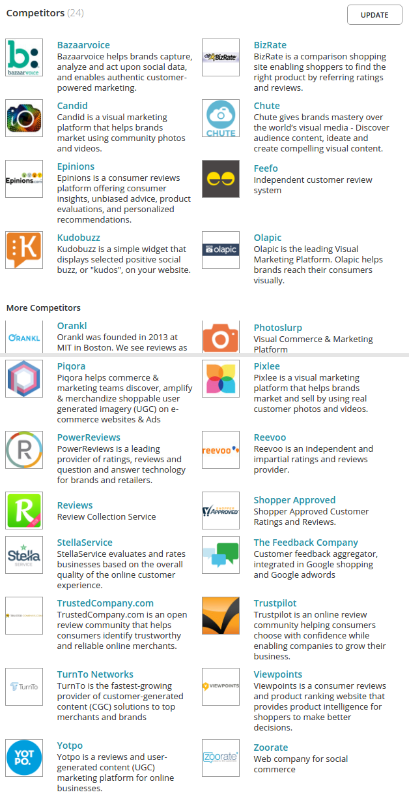
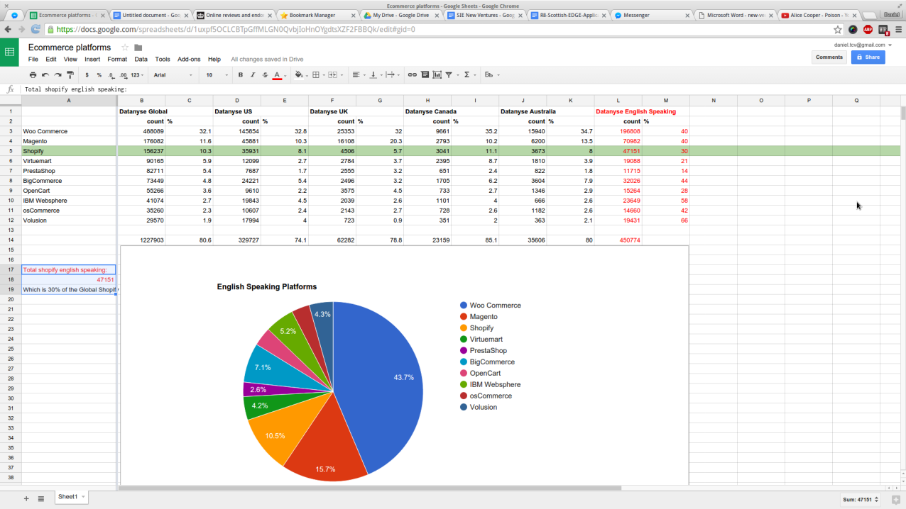

## Mission Statement
Increase the trust in the online shopping experience.

## What do we do?
Opinew was created to provide small and medium enterprises with affordable online review management system. The current solutions could be very expensive for small companies or miss critical features like responding to a customer review or allowing rich multimedia like photos or videos to be included in the review. Given the explosion of video and picture content in apps like Instagram, Pinterest and Youtube this lack of keeping up with the trends gives less opportunities for business owners to interact with their genuine customers. A not optimal solution is an inhouse review system but managing online reviews for a lot of products is a very complicated 

## 3-minute pitch
### Intro & Tag line
Today 90% of people who shop online read reviews so it is important for shop owners to manage those reviews properly and this is what Opinew does - we manage online reviews.

### Problem
When you are a shop owner, managing reviews can be very time consuming. Asking customers for reviews, responding, promoting reviews on social media, fighting spam. You can spend more than 8 hours a week on that. When you think about it - that’s one person’s entire working day! 

### Solution
Our goal is to take all of the burden from shop owners and make everything automatic. From asking customers to leave reviews to selecting helpful reviews and detecting fakes. To do those tasks we use cutting-edge Artificial Intelligence systems we developed.

But apart from automation we go visual. For businesses like clothing and jewellery, visual reviews are crucial and that’s why we enable customers to post photos and videos of the products they bought. 

So our powerful Artificial Intelligence that makes the process automatic and visual reviews are the things that differentiate us from yotpo who are our main competitor. We offer a better and smarter product and we do it at an affordable price.

### Business Model
We sell Opinew to Online shops on a subscription basis for £20 per month. We want to develop more expensive plans with more advanced features as we progress.

### Traction
In February we made Opinew available on Shopify which is a system on which you build online shops. So we released on their app store to validate the product and to test our email marketing campaign. It was successful. Over 100 shops installed, 40 of them are still using the application.

### Market size
Our current target is 200,000 shops worldwide which are built on Shopify. We chose Shopify because it was the quickest one to develop and test our business, but we want to develop for Magento and WooCommerce which will open us to additional 2 million shops.

### Team 
We are able to do all that because we understand technology and science behind reviews. We are a team of two developers with experience of working at Google and we have support from leading researchers at the University of Glasgow.

### Future plan/Roadmap
Right now Our PLAN IS TO MAKE THE COMPANY PROFITABLE ENOUGH in the next 3 months TO SUPPORT AT LEAST 2 PEOPLE. To achieve that we want to run an email marketing campaign on 9000 leads we gathered, together with a series of blog posts to bring shop owners to our site. On the tech side we want to finish the beta and develop the magento version of Opinew.
We have been working really lean for the past 6 months doing everything ourselves but we need to start filling the gaps in the team.

## 1 minute pitch
If you are selling anything online you know how much reviews matter for your customers. But you also know what kind of pain they are.

Kicking spam and trolls away, sending emails, begging for a 5-star review and then haters just leave you 1 star with no explanation.

Opinew has a solution for you. We provide you with the state of the art review system that goes beyond just text and stars. We use our powerful algorithms to do all the heavy lifting for you  -  message your customers at the right time, filter and rank the reviews. And best of all - it’s dead easy to setup

We can target more than 400 thousand shops worldwide following a tiered model with prices starting at just 29 pounds a month.

We are a team of two developers with experience of working at Google and now after five months of development we already help our first shop owners managing their reviews more effectively with Opinew.

Try our product for 30 days free today with no strings attached, especially if you have ecommerce shop at shopify.

Opinew.com - beautiful and smart reviews.

## Transparency
Existing solutions lack transparency over the methods by which they authenticate reviews. Hiding reviews is potentially unlawful.

Our USP include:
* Complete transparency over the process of gathering reviews and exposure of inside information about the metrics of the current review without compromising customer privacy.
* Machine learning algorithm that surfaces the highest quality reviews developed using state of the art technology and using latest data from scientific research in the field of customer reviews.
* Ability for customers to express themselves using photos, videos and other interactive content. This is twofold: it increases the credibility of the review and reviewer, and taps into the Millennials desire to share interactive content. Existing solutions provide this feature after having to pay more than $400 per month.

The market for online reviews is very diverse - from big brands like Bazaarvoice and PowerReviews offering custom white label solution for large brands to medium sized (like Yotpo), to small and independent providers - like Kudobuzz or Orankl; from open systems (anyone can post a review) to closed (only verified purchasers can) and hybrid. 

Research conducted by Competitions and Market Authority (CMA) points out that most of the current solutions lack transparency as to how reviews are collected, verified and ranked which raises concerns about the authenticity of reviews. The research finds that the biggest problem in the industry are fake reviews - both positive (usually posted by the merchant) and negative (by competitors) and suppressing negative reviews can even be seen as an illegal activity. By transparently pointing out everything that our system was able to analyse about a review, presenting it as a simple metric of authenticity, we can increase the quality of reviews dramatically making it safer both for the business and customers, relying on the Opinew brand as an impartial verifier.

We have spent the past 6 months conducting interviews with prospective clients, researching, prototyping, developing and testing our product and now we have reached an important milestone - releasing our plugin to one of the largest ecommerce platforms, namely Shopify. The system is not complete however and we need additional development effort to build support for multiple verification pipelines, releasing our product to several more e-commerce platforms, internationalization and developing our marketing strategy.

## Strategy
Online product reviews as a plugin
Improve the customer journey
Allow people to easily find and sell products based on the trust that exists between the parties (Product Hunt)

## How do you make money/what is the business model?
We follow a tiered subscription model. Starts from $20 per month and when we add more features we will introduce more expensive plans.

## Why you?
We are running the business as lean as possible. So far we ran our current business for 7 months and spent less than $100. We are both developers so we don’t spend tens of thousands on dev. We got more than $70k from grants like FacebookStart, Rackspace etc.
We have a hard to replicate Artificial Intelligence algorithms for predicting review helpfulness and fake review detection. Nobody else has that.

## Why reviews?
Have spent the last 2 years looking into opinions and reviews, reading research papers and getting to know the market, features and technology. We know it can be improved a lot.

## Who are your competitors?
Companies that provide review management for small to medium ecommerce websites. To name a few of them - Yotpo, Feefo, Kudobuzz or Orankl are on our watchlist.

[Crunchbase](https://www.crunchbase.com/organization/opinew]

## How are you different than your competitors?
Artificial Intelligence algorithms for predicting review helpfulness and fake review detection.
We enable reviewers to include photos and videos in their reviews. Most of our competitors don’t have that support and the ones that do, put a price tag that only large shops can afford. Looking at the explosion of apps like Instagram and Pinterest, at Opinew we believe that video and picture content which allows customers see how products look in real life, should be a standard in online reviews.

## How are you different than Yotpo/feefo/trustedreviews/bazaarvoice? (I.e. specific competitor?)
All of them - We differentiate by all of them by our AI algorithm, bringing high quality of reviews as well as high quantity.
Yotpo - Pricing
Reevo/Bazaarvoice/TrustedReviews - Not direct competitors as we are targeting small to medium ecommerce businesses.

## How much are your competitors charging?
from $8 to even !$700! per month for different companies per month. On average £15-20 for similar features that we currently provide

## What are you going to charge different tiers for?
Basic - £19 per month. 
Additionally, as more features are developed, the following plans are to be introduced:
Pro -  £89 per month. 
Enterprise - £169 per month.

## Why your customers care about reviews?
High quantity and high quality reviews increase sales. Different studies showed numbers from 5% to even 20%. 
Additionally for some industries like clothing and jewellery, visual reviews are crucial.
A recent survey by Bright Local conducted on a group 2500 participants and found that 92% of online shoppers consult reviews before deciding whether to make a purchase or not - a number which has been growing every year since each year more people get comfortable with convenience of online shopping.
 

## How do you know your customers need your product? How do you know there is demand?
There are existing solutions that ecommerce shops install. Additionally, being at espark has made us see that new companies  desperately need reviews to validate against their own competitors. We believe our innovative machine learning algorithm will provide higher quality as well as high quantity reviews.

## What is the market size?

We can target immediatly ~50k shops in English speaking Shopify which is ~30% of the global Shopify market.
Largest ROI: Developing a plugin for WooCommerse, we can target additional ~200k.
Second largest ROI: We already have partial support for magento. Developing a plugin there gives additional 70k.
English: Additionally, we can target ~450k English speaking shops in the 10 largest platforms
The global shop market on platforms is around ~1.5M Shops 
In Bulgaria we can target around 2k and in Poland around 7k shops, however shopify is not well there - potential referal?

Worldwide e-commerce market of over 5 million online shops is worth £1.4 trillion (£2.5 trillion in 2019). Our current target is 200,000 shops in the English speaking world which are built on Shopify, Magento and WooCommerce e-commerce platforms. These three platforms cover 40% of the entire e-commerce market.
Shopify - 200 thousand
Magento - 335 thousand
Woocommerce - 1.85 million
 
## How will you reach your customers?
We will reach our potential customers through the app stores of the e-commerce platforms. So far Opinew has been approved by Shopify and thanks to that we can immediately target more than 30,000 shops that do not have a review management app. Next on the roadmap are Magento, for which we already provide partial support and Woocommerce - the largest e-commerce platform globally.

## Who is your next target market?
We have partial support for Magento already and creating an extension on the Magento marketplace would give us access to additional 70,000 shops.

## Is somebody paying for your service?
We have 8 companies that are currently on our first tier.

## What are the key gaps in your team?
We lack experience and expertise in marketing and sales although espark has been helping us get that knowledge and practice.

## What are the key strengths in the team?
We are both software developers with experience of working at Google, in-depth knowledge of how product reviews influence consumer choice. Additionally, we have already run a startup that unfortunately failed but have the patience and persistence in the last two years to keep us going.

## How has espark helped you so far? How have they brought value to your business?
We learnt the basic business skills - pitching, sales, marketing, knowing the numbers of the business, talking to customers. 
We got direct exposure to our target cutomers - online shops - which there were a few at the hatchery.

## When will your business be profitable?
We will be able to sustain ourselves as soon as we have 120 customers on the basic £20 plan. Initially, due to the technology at scale, gaining additional 60 customers, we can sustain an extra employee on a minimum wage.

## What is your 3 year projections?
Assuming we can expand to the top 5 ecommerce platforms as our technology scales, we believe with the right team and resource management, in a rapidly growing ecommerce market, we can achieve half a million pounds in revenue in 3 years. 

## What are the assumptions behind your projections?
We assume churn rate will go down from 20% to about 5% in 1 year as we develop more features, lock in customers for yearly subscription plans and provide great customer support.

## What have been the key highlights in the past 3 months of your business?
We got 21$ for services from Facebook Startup which helps us with getting costs of our payments and mailing service down. Additional grants we can use for translations and video marketing.
$21k Rackspace startup programme for 1 year of server resources
$12k Neo4j startup programme - for enterprise support for graph database

## When have you started building your business?
October last year after a painful lesson in not speaking to customers.

## Do you have protected intellectual property?
It’s pretty much impossible to get IP protection on software in the EU but we do have the copyright laws protecting it.

## Have you spoken to your end users?
We spoke with 10 top Amazon reviewers and 23 online shop owners in Glasgow area, before designing our software. We also run a focus group with about 20 non related people who were invited to a fb group to post photos and comments about things they own. 
We continually engage with our existing customers to get feedback. We also ask the customers who uninstalled Opinew to tell us the reasons for leaving us. We use this feedback to plan what to improve and what to develop next.

## Can a customer remove a review?
Yes, but only after we verify that the review is offensive, fake, or spam.

## What happens with the negative reviews?
We are building a system for managing the negative reviews which we call the customer journey. If the review is genuinely negative we first hide it for 7 days to allow the shop owner to resolve the issue. If it’s resolved and the customer is happy we increase shop’s customer service score which shop shows to other customers.

## What are the key benefits to your customers?
Automation
Visual reviews

## What percentage of the increased sales would be due to validated/authentic/picture reviews vs just plain text?
We know that reviews, especially high quality reviews increase sales, different studies and research show.

## What is your exit strategy?
Either continue growing the company or sell the business to another company

## Why visual reviews?
They bring a lot more validation than just text and stars. They are perfect for shops that sell visual products like clothes or furniture( we also found quite a few hair extension stores that love it). People who buy those visual products want to see how they look in real life and the shops want to showcase their products in hands of their customers. 

## Why your customers care about high quality reviews? Don't they just care about quantity?
People don’t just look at stars, they read the reviews. Even better the photo and video reviews that in a brief moment can explain what a lengthy text review does.

## What stops your customers to write fake positive reviews about themselves, fake negative reviews about their competitors?
Fake detection system

## Have you tested the fake detection system?
We ran some tests. Main point is that this system has been applied and tested in other areas of computing like commentary forums.

## Have you tested the quality ranking system?
A double blind study showed that 70% of people prefer our solution to standard ordering by time of posting.

## What feedback are the current customers giving you?
As for now: The user experience on the admin panel has to be improved. It’s sometimes confusing. 
The email messages should be editable by the shop owner. We currently provide a form that is the same for all shops.
Generally all of the features we developed were taken from customer feedback. We did the mistake of developing blindly with our previous startup that failed. We are not repeating that and carefully listen to customers all the time.

## What feedback are past customers (uninstalled) giving you?
We have emailed the users who have uninstalled and the feedback was generally a little complicated setup. We are looking into making it easier by decreasing the number of steps.

## Why do you have so many people uninstalling you?
Not all of the people have gotten back to us, but we are tracking if there are any problems on our side and we haven’t seen any. We think it might be due to a slightly complicated installation process and we are looking into making it easier while communicating about best practices with the shopify app development team.

## What stage is your business?
We have passed the market and product validation stage and now we are looking into improving our current offering and going into growth.

## What is your USP?
Increasing the quality of reviews with a machine learning algorithm.
Ability for customers to express themselves using photos, videos and other interactive content. The impact of this is that it increases the credibility of the review and reviewer, and taps into the Millennials desire to share interactive content.
A single place to collect and manage reviews from all social channels in order to show the fullest picture to both shop owners and customers.

## How are you engaging with your market?
We will reach our potential customers through the app stores of the e-commerce platforms. 
We also have 9000 leads to Shopify shops, which we will use in cold calling and e-mail marketing campaigns.

## What is the innovative element in your application?
Artificial Intelligence algorithms for predicting review helpfulness and fake review detection.
Customer journey system for managing negative reviews

## How have you used the grants so far?
We have been using the Rackspace server grant to set up and deploy our application. 

## If you fail EDGE, what's next? Are you continuing? Do you have other options?
We believe that we can reach our target of 120 customers without the funding but it will be a very slow process because we would have to do marketing, sales, customers service AND all the development all by ourselves.
Maybe we will be able to get ONE person to help us with marketing on a commission basis.
We have been executing our startup(s) in a lean fashion in the past 2 years. We can continue doing that because we are passionate about what we have created so far and believe the market for our product is there. However EDGE will help us to reach our goal of being profitable enough to sustain ourselves MUCH faster than we can do it on our own.

## Who is your customer?
Retailers of small and medium e-commerce businesses.

## What are the best social websites that you are going to use to drive customers?
Facebook - 
Twitter - Yes, sharing our blog posts.
Instagram - Yes, share reviews.
YouTube
Pinterest
Medium - Resharing our blog posts.

## Would not allowing customers to remove reviews put them away?
Opinew stands as a mark of trust.

## What if they use your plugin and then they just copy and paste the reviews after two months? (Dianne situation)
They Are losing the review management service. Also if they have future products, they won't have reviews there. 

## What services are you providing so that you could lock your customers in after the trial?
Automated emails.
Q&A
Management of the reviews

## What are you going to spend the 10,000 on?
We want to get sales and marketing people on board. Team skills gap

What
Description
Cost
Magento developer
6 weeks project to develop Magento connect extension, PHP, JS
3500 
Content writer (Andrej)
3 months trial contract with potential for full timer. Responsibilities:
Blog posts to inform our users - 1 per week (12 blog posts). Increase SEO
Ebook - mainly for lead generation (behind a “Give us your email” wall)
Social media manager

3500
Sales (Alexander)
3 months trial contract with potential for full timer. Responsibilities: 
Cold calling leads after email.

3000

## You have a churn rate of 50% - how are you going to bring it down?
Yearly subscriptions lock.

## Who are you targeting with blog posts? What is going to be the topic of these 12 posts?
Shop owners. We want to inform them why outsourcing the review system can be beneficial, how visual  and authentic reviews are going to benefit their sales.
The blog posts are also going to bring traffic to our website when shared on social media.
Promote our ebook(s).

## What is the purpose of the ebook?
Providing additional tips and tricks about making the reviews better.
Generating leads by getting emails from interested customers.

## What’s are the best case and worst case scenarios of your 3 month plan
Best case: 300 customers; 2 Full time employees (1 content writer and marketing; 1 sales)
Worst case: 200 customers; 1 Full time employee (1 content writer and marketing)

## What are you guys going to work on?
Daniel  - development of Q&A, customer journey, porting and testing the machine learning algorithms.
Tomasz - automating email marketing & customer support.

## How many leads do you have / How many leads have subscribed / What is your sales funnel so far like?
We have 9000 leads from shopify generated by us.
In the past two months, we have sent 700 emails on a split testing of which about 20 have converted.

## What are your tiers going to look like?
Tier 2 is going to cost 89 pounds and is going to provide Questions and Answers and the Customer journey.

## How many customers do you need to break even?
With our current 19 pounds per month with only the 2 of us, we need about 100 paying customers every month to support ourselves.
In the beginning, every 60 new customers could allow for an additional full time employee.

## From the 3 employees that you want to hire, who is the most important right now?
Sales, we know we have a team gap. (Don’t explain - Because the magento extplanon can wait and we already have 9000 leads.)

## What is the biggest risk that you are facing?
????
Easy to copy

## Has it been only the two of you so far?
We’ve had 3 guys on a trial basis - 2 helping us with the email campaign and 1 that we are trialing for our content writer.
They are working on a pro-bono basis, just to get experience in the startup and for us to trial them. However, we want to start paying them as soon as we start making enough money to also support ourselves.

## AWS

Server
Properties
Rackspace (current)
General purpose v1:
1 gb RAM (using about 800 mb)
20 gb HDD (using about 5 GB)

AWS
T2.micro:
1 gb RAM
High Frequency Intel Xeon Processors with Turbo up to 3.3GHz

# TODO: Remove?
### Who is the customer? Who is going to pay the money?

### How do we make money? What is the business model?

### What is the market size?

### Who are the main competitors?

### How is that different than the competitors? Why does it matter?

### What is the competitive advantage? What is the Unique Selling Point?

### How are we going to reach our customers? What are our channels?

### Who is out first target market?
