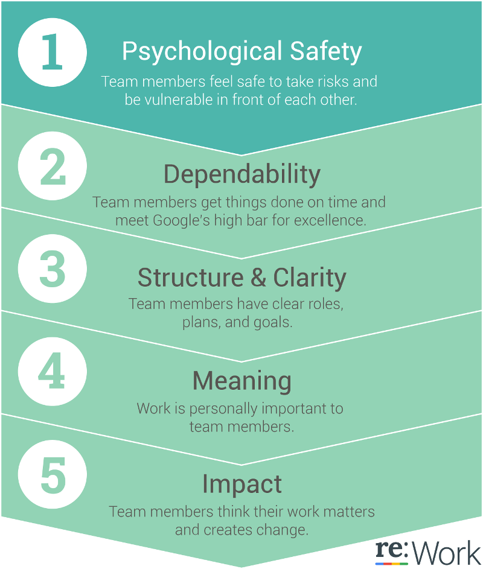
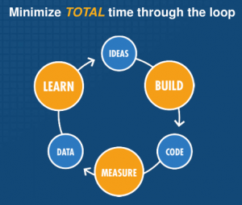

# The organization

A good team consists of people who:
* Get enough money to live life their way
* Have the ability to travel, get new tech gadgets and experience the world
* Have the freedom to spend free time - Breaks and vacations whenever they want
* Learn and explore new things, train and apply old knowledge
* Create something that can be of use to a lot of other people
* Have a good time interacting with other smart people and work on exciting new ideas

In the past 2 years we've been almost solely developing web applications. While everybody has an opinion as to what it should look like, you start noticing some pattern, best practices as well as burning yourself as well in the process. Here is my take on how a scalable, fast, secure web application should look like in 2016.

Of course, reading is not doing. Software development is hard but it’s also extremely exciting. Making a business out of software development is even more exciting. There are so many things that have to learn and click together that we decided to write this to try to explain what we have been doing in the past couple of years.

We like comparing software development to buildings and architects - sure, anybody can get a piece of paper and doodle a house (three year olds do it, probably three year olds will soon or will already write simple apps) but it takes experience and understanding to design and build a nice house or a skyscraper. There is planning required, implementing, testing that the floors don’t break and every few months new amazing types of bricks and hammers arrive that you want to try to use.

We are going to share the main lesson that we started realizing is needed for a successful venture so that the instant gratificators out there (including future me) can get their dose: Create an environment that allows for quick, easy, scalable and free experimentation.

## Foster experimentation
Experimentation is at the heart of the scientific model. It’s the most successful and most natural model humanity knows of for learning new things and trying out ideas. A startup in an essence is a learning thing. An experimentation in the software world needs to be … because: …:
* *Quick*: Things in IT are moving quickly, new things come along, people want to try them out. But that also means that people in the world need different things all the time with that changing environment. Therefore we need a quick way to try things out, fail quickly or succeed and learn from it
* *Easy*: People won’t do it ff there are many obstacles in experimentation. And if people don’t do experimentation, the software will be stuck with whatever hypothesis we began early in the process and chances are, they will be wrong.
* *Scalable*: Software grows in complexity that human brains are yet to understand how much exactly. Therefore, it is important that experimentation should be at the same level when it’s day 1 or year 10; when working alone or working with 10 teams of 8 people. Software is always easy when there is a blank canvas and if we don’t allow for scalable processes, soon it gets beyond the comprehension of anyone.
Free (as in freedom): the real bottleneck in software development is people. If people feel oppressed, forced, catching deadlines, unsafe to ask questions, spawn ideas and feel judged - they will not experiment.

The idea about experimentation is not new. Methodologies based on the [Manifesto for Agile Software Development](http://agilemanifesto.org/) like [Scrum](https://en.wikipedia.org/wiki/Scrum_(software_development)), [XP](https://en.wikipedia.org/wiki/Extreme_programming) and [Kanban](https://en.wikipedia.org/wiki/Kanban); ideas based on the [lean manufacturing model](https://en.wikipedia.org/wiki/Lean_manufacturing) all talk in some way or another about moving quickly, responding to change and listening to the input you are getting from your customers. Yet, did we follow it in the past 2 years? No. Why? Because I just wanted to code. Somedays we do want to just code. But when the drawing of my cute house becomes real, I realize that the architect in me has fallen asleep, the child has woken up and has created something nice and cute, but not physically possible.

Sounds logical? You know the 5 to 9 things your brain can cope in a certain time - it's about short term memory, I know. But if you expand the picture into daily things that you need to care about in a small startup of 2-3 people, the amount of things that you need to care are too many. Let me give you an example with what a web app should be if we follow so called "best practices".

In the book [The E-Myth Revisited](http://www.amazon.com/Myth-Revisited-Small-Businesses-About/dp/0887307280), the author talks about three people living inside one’s head - the Entrepreneur, the Technician and the Manager. And we have prepared three hats that I will be putting on as we move forward.

He also talks about hard, soft and information systems that need to play together. A great book with many lessons and a bit of craziness, this book started changing the way I was thinking about my little company. Over the next three sections I am going to describe my view on how to implement these systems in the context of software development best practices. As you will see, tools and processes will repeat over and over again when we thinking about our main goal - allow for experimentation.

## People and Culture(the soft system)
As we mentioned in the opening paragraph, we believe that allowing for experimentation is above it all. If you think for a minute a bit cynically and consider people as nothing more than a flaky hardware (maybe something like a [printer](http://theoatmeal.com/comics/printers)) and consider that you have to build algorithms on top of that to help experimentation foster - what would they be?

Well, Google made a great study that they call [Project Aristotele](https://rework.withgoogle.com/blog/five-keys-to-a-successful-google-team/) in which they analyzed what makes a great team. The key 5 characteristics they found people and teams need to perform.

Google being Google done all of that through their own team study and lots of data. So now, that we have the hardware specs and we want to foster experimentation, let’s borrow some of the agile/lean stuff we talked about:

To help with *psychological safety* and make teams feel safe to take risks and be vulnerable in front of each other, how about implement:

* Pair programming - Share the responsibility of coding together, share the risk with a person and get to know each other’s styles of thinking and coding.

* Code review - if pair programming is not an option or we feel tired that day, let’s do code reviews. Make sure that you are shooting down ideas not people, raise any questions, share the responsibility of putting code on master branch to the two people who have both authored and reviewed, not only authored code.

To help with dependability:

* Break down tasks until you think you can code that in less than (arbitrary number here) 100 line changes including additions, deletions and changes. We all know software development is unpredictable, but breaking it down with small commits
Testing - make sure that people trust the code that is written
Not everyday is a great day. People are just slightly more intelligent monkeys. Monkeys are emotional, irrational and have the agenda for keeping the body alive and well. A great model, taken from the book “The chimp paradox” explains that basically, you can think of your mind of a monkey and a human. The human’s agenda is to think of a higher purpose, to self improve, to be great. But we can’t be a human if we haven’t satisfied the monkey. Another view is the Maslow’s pyramid of needs:

To help with *structure and clarity*:
* Physical Kanban board - Keeps track of what is being worked on and how far are we from getting things done. [An excellent video](https://www.youtube.com/watch?v=CKWvmiY7f_g) by the project manager of XBox in Microsoft is getting an overview of how to use Kanban in software dev in the first 15 minutes and then uses Kanban to explain Kanban. In the Q&A session he also says that a Physical Kanban board is always better than virtual unless its a geographical disparity.
* Issue tracker - spend the end of the day for about 5 minutes to sync the state of the physical Kanban board and the virtual issues on the issue tracker. The issue tracker is needed to keep track of larger issues coming in and getting data of severity, priority etc. The Kanban board and Issue tracker don’t have to be in perfect sync - the tools serve us, we don’t serve the tools!
* Have a finish line and celebrate milestones - This is something I discovered in my own company. Issues and features kept piling on and I had no idea when will all that end. It’s highly de-motivating to run a marathon with unknown length. Set a goal and when we all reach it - take a break, celebrate.

To help with the last two - *meaning of work* and *impact of work*:
* Gather data of usage using loging and monitoring tools.
Schedule time or a place to tell user stories - both fictive (to get functional tests passing) and real (from real customers).
Get everyone (from dev to marketing) to talk to at least one real customer every month- why is the product we are building great? How does my work impact him directly? What issues are there? Desires? Pains?
And finally, to help with our own top goal - experimentation:
* Continuous integration - Deploy quickly and frequently. For that we have at least three more dependencies:
* Version control in a branched distributed system like git
* Automated testing in various levels
* A deployment strategy - One command to deploy

## Information systems
This is the glue - the loop that ensures we are doing things right and our experiments run. What kind of best practices am I going to follow? We all know them - testing, version control, continuous delivery - and rarely use them. They will get done… one day - but not now. Why? Well, because I want to get something working now! But that comes at a cost. It’s a debt that you are imposing on yourself or your team. Somebody needs to pay that if it is to be a successful project. Sometimes credit is needed and it’s not impossible to pay it back - people pay their debts but why take a credit if we have a system that makes it easy not to get a credit? We invert the process.

There are a few cute 12-step guides out there. Blog posts that stood the test of time like this one called [The Joel Test](http://www.joelonsoftware.com/articles/fog0000000043.html). Another one is the [12 core values of Extreme programming](http://c2.com/cgi/wiki?ExtremeProgrammingCorePractices). And another set of 12 steps is [12-factor app](http://12factor.net/). Nice stuff to read.

Are these the only ones? Hell no. Are there other ways to build software than the one I’m proposing? Hell yes. As I’ve said, this is more a documentation of what I’ve done and rationalization rather than a “You must do this or you will not succeed”. Do whatever works for you, this are just best practices principles that I’ve found are quite nice to follow. From my point of view, they still point to the goal of experimentation. Just look at another one of the popular techniques these days, [The Lean Startup](https://www.amazon.co.uk/Lean-Startup-Innovation-Successful-Businesses/dp/0670921602) (another excellent book that I highly recommend):

If that’s not the scientific model of experimentation? Okay, ready for my form of The Lean Startup?

Here are some best practices that I’m going to follow in this tutorial:
* Test Driven Development - Don’t wait to test until it’s too late. Let the tests drive the design. This is the Build-Code part. Because testing helps you uncover regressions, not only find bugs. There are functional tests, unit tests, integration tests, manual tests… We will use them all!
* Data Driven Features - Get data about what features are useful or what users seem to want. This is the Measure-Data-Learn phase in the top graph. For that we need to be able to collect usage data, create feature/issue requests, create easy A/B/C/... testing
* Feature Driven Deployments - Don’t wait until the application is huge to deploy. Keep it lean and deploy as we have anything to show. The shorter we keep the loop, the quicker we can iterate. We need repository, version control, end-to-end automation for deployment.

But I missed one part of the graph - the Idea. Where do we get that from?

Developing the agile way make s you do things quickly which is not necessarily the best way. Quick does not account for change. And change is how software is developed. But hey, you are wasting my time - Let's get my website up and running, this hello world thing! And somehow the following principles start fading when we all know they are good:

I will test it... someday.... Sure it's important, but coding is more important! Bringing value man!
I will deploy it... when I have something to deploy...
Version control.... let me just write these 10-15 files that do something, and I will do it, I promise

Are they in the Agile manifesto - no, customer collaboration over tools and processes right? They value the things on the left so let's do these first!

And when you do these first...Well for one doing something quickly and putting it out there throws all discipline out the window.

## What is the organizational chart? Who is responsible for what?

### President
Reports to shareholders
Responsibilities:
Ensures company is providing value
Secure capital
Hiring people and making sure they fit into company’s values

Assigned: Tomasz Sadowski

### VP Sales & Marketing
Reports to President.
Responsibilities:
Finding customers and opportunities
Going to meetings
Finding leads, tools to do marketing better

Assigned: Tomasz Sadowski

### Sales Manager
Reports to VP Marketing
Responsibilities:
Designing the sales process
Contacting leads and taking them through the sales process
cold calling

Assigned: Daniel Tsvetkov

### Marketing Manager
Reports to VP Marketing
Responsibilities:
Communicating company’s identity, values and mission through branding
Making website graphics
Writing Articles about reviews
Design email marketing strategy and work on writing emails

Assigned: Daniel Tsvetkov

### VP Finance
Reports to President
Responsibilities:
Forecasting
Monitoring and managing money in and money out

Assigned: Daniel Tsvetkov

### VP Product
Reports to President
Responsibilities:
Defining requirements
Planning for product improvements

Assigned: Tomasz Sadowski

### Customer Support Manager
Reports to VP Product
Responsibilities:
Resolving customer’s issues
Backlogging customer’s requests

Assigned: Tomasz Sadowski

### Technology Manager
Reports to VP Product
Responsibilities:
Choosing the underlying technology
Implementing and testing the product

Assigned: Daniel Tsvetkov

### Research and Development
Reports to Technology Manager
Responsibilities:
Researching new technologies and methods to push the boundaries of the product’s awesomeness

Assigned: Tomasz Sadowski

### How many people in a team? What are their roles?

### How many hours am I expected to work?
Working more than 40-hour weeks regularly decreases productivity. [We don't do it](https://www.salon.com/2012/03/14/bring_back_the_40_hour_work_week/). We strive for work completion and value sanity, work-life balance over long hours.

### How do you measure productivity?
We use a system developed by Google called [OKR](https://en.wikipedia.org/wiki/OKR) (Objectives and Key Results). Basically it means that you set your goals and how you would measure them, then you execute and measure them comparing expected to actual. It should be around 0.8 (too low = unacomplished; too high - you have set a low goal; we prefer lower grades than seeing >=1s).

### What is the work schedule in a typical day? Week?
Nothing is strictly enforced but there are some recommendations.
* Decide what are the things that you want to work on the day before. Have a good night sleep.
* Pick the easest task in the morning.
* Take regular breaks - water, coffee, just hang out for 10 minutes. Your background tasks should be utilized as well.
* Try to work on no more than 2 issues at a time. Ideally it should be just 1.
* Checkout-implement-test-submit.

Once every week there is a half-hour team meeting. Preferably Tuesdays or Wednesdays.

Once every week have a one-on-one half an hour with your manager. Helps bring up more private issues.

Once every month we have a 2 hours all hands session. Anything can be raised by anyone.

### How often is code releazed?
We use Continuos Deployment using Jenkins. As we try to break issues into smaller parts, code can be released very frequently. We aim for multiple times a day.

### What is the development process from code's perspective?
Code gets checked out and developed locally by picking a bug/feature from the issue list. The development could be pair-programming or alone. The developed code is also tested and coverage calculated. Code gets submitted for code review and additional verification (static code analysis, integration testing). If they all pass, Code gets merged to the master branch. Master is build on CI server and pushed to a staging server. A load balancer linearly starts redirecting some trafic to staging server and backtracks rapidly on any server errors. Eventually staging server gets 100% traffic, gets renamed to production server and previous production server becomes staging.

### What is the testing culture? Do we have Unit/integration tests? What does a QA process look like?
Some teams can practice Test-Driven Development but it's not required. People think differently and some like to first do tests, other don't. Sometimes test are not too clear if we start with tests. Eventually all code should be unit tested and some smaller amount of functional and integration testing is done to verify the output from user's perspective. We aim for at least 85-90% code coverage and a build fails if it is below that level.

### How teams work? What sort of sw develoment process/methodology? Any agile methodologies enforced, recommended or practiced?
Each team can decide for itself - nothing is enforced. Agile methodlogies like Scrum, XP and Kanban are recommended but teams work differently as people are different.

### How the team communicates and collaborates?
We use Google Hangouts for communication.

### What do we use for source control?
[Git](https://git-scm.com/). It's not the easiest learning curve, but it's the most used out there, it allows you to easily experiment and revert which complies with our Scientific way of development.

### What do you use for bug/task tracker?

### How do you define configuration in different environments (dev/test/prod)?

### How do you isolate processes?

### Do we do code reviews? What is the process?
Either pair-programming or code review is a necessary condition for commiting code. 2 more eyeballs can catch a lot more errors especially when your own ego isn't involved.

### How do we prioritize features vs. bugs (new development vs. fixing existing code)?
Generally you want to fix bugs before writing new code. [The Joel Test](http://www.joelonsoftware.com/articles/fog0000000043.html).

### What is the up-to-date schedule and where can I find it?
Having a schedule forces you to plan and prioritize features and stay on the same page as the rest of the business. [The Joel Test](http://www.joelonsoftware.com/articles/fog0000000043.html). We use Google Calendar to put organize dates.

### Do you spec out features before building them? How?
Finding and fixing problems is dramatically easier in the design stage.  Specs save time and frustration. [The Joel Test](http://www.joelonsoftware.com/articles/fog0000000043.html)

### What is the work environment? Noise levels? Interruptions?
Quiet space and privacy have well-documented productivity benefits. We don't like open space, sorry. We find it too distracting for work. There are common areas you can go and hang out but when you work, you (and potentially your pair-programmer) are isolated. [The Joel Test](http://www.joelonsoftware.com/articles/fog0000000043.html)

### How do we do UX / usability testing?
Grabbing five or six people in the hallway is a good start.  User studies are even better. [The Joel Test](http://www.joelonsoftware.com/articles/fog0000000043.html)

### Do we do design reviews? Before writing code?
In all but the smallest of companies and tasks, getting input from others before starting can save time and effort. Studies show that making changes post-delivery is 5x (for small projects) to >100X (for large projects) more expensive than during requirements definition.

### Are there all-hands meetings? How do we ensure people's voices are heard, valued and respected?
[Research](https://rework.withgoogle.com/blog/five-keys-to-a-successful-google-team/) shows the most important factor in team effectiveness is psychological safety, a "shared belief held by members of a team that the team is safe for interpersonal risk-taking."  One component of this is conversational turn-taking, or that everyone talks roughly the same amount.

### How are you chosing the software tools? What do you value in them?
We want tools that have stood the test of time, are still in wide use and are actively deloped. We acknoledge that this requirement is hard to follow since new tools appear all the time and the hype is sometimes hard to ignore. But the rationale is - if the tool is relatively new and in active development - unexpected errors will pop up that nobody has dealt with in the edge cases. This may take time to get fixed if at all and it will probably bring new errors.

We also prefer open sourced software. Companies go out of business all the time. If the tool is good and people use it, people help it grow.

In general, use the version before the latest stable - that is about 1 year old. That ensures that the version is being tested and there are enough stackoverflow articles about it.

| Software  | Years since release  | Risk of unexpected breaking |
|---|---|
| Vim | 1991, 24 years | Low |
| PostgreSQL  | 1996, 19 years  | Low |
| Nagios | 1999, 17 years | Low |
| Eclipse | 2001, 14 years | Low |
| Ubuntu | 2004, 11 years | Low |
| Nginx | 2004, 11 years | Low |
| Git | 2005, 11 years | Low |
| RabbitMQ | 2007, 9 years | Low |
| Virtualbox | 2007, 9 years | Low |
| JQuery | 2006, 9 years | Low |
| Jenkins (forked from Hudson) | 2011, 4 years (2004, 12 years) | Low |
| Gerrit | 2009, 7 years | Low |
| Flask | 2010, 6 years | Medium |
| Vagrant  | 2010, 6 years  | Medium |
| PyCharm | 2010, 5 years | Medium |
| GitLab | 2011, 5 years | Medium |
| Ansible  | 2012, 4 years  | Medium |
| Docker  | 2013, 3 years  | High |
| Atom | 2014, 2 years | High |

### Do we do hackatons/20% time projects etc? How about contributing to open source?
We acknoledge that in a rapidly moving programming environment people have different interests which change over time. We are following a similar to Google 20% project time - you can work on whatever you want 1 day of the week as long as you are not the only person working on that project (i.e. find a buddy within the organization).

### How do we make technical hiring decisions?
This is important because it helps you see what people you are going to work with. Five or six technical interviewers vote via secret ballot; all must agree (except perhaps one junior engineer), or it's a no-hire.  No one should be able to hire unilaterally or override the vote of someone else; everyone should have unilateral veto power. The cost of a poor hire is far greater than the cost of missing a good hire.

### How do we monitor metrics?

### What metrics are we monitoring?

### How are we leanly validating ideas?
