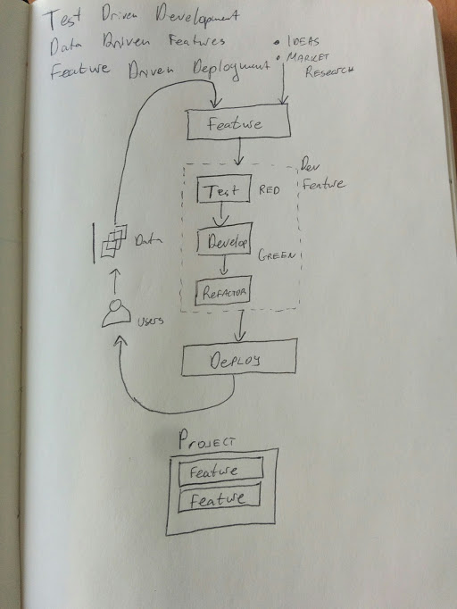

# Building a Web SaaS Start Up - lessons and practicals
## Table of contents
<!-- TOC depthFrom:1 depthTo:6 withLinks:1 updateOnSave:1 orderedList:0 -->

- [Building a Web SaaS Start Up - lessons and practicals](#building-a-web-saas-start-up-lessons-and-practicals)
	- [Table of contents](#table-of-contents)
	- [Introduction](#introduction)
		- [Motivation](#motivation)
		- [Why a web app?](#why-a-web-app)
		- [Why the DevOps way?](#why-the-devops-way)
		- [Pre-requisites](#pre-requisites)
	- [The Business](#the-business)
		- [The tools](#the-tools)
			- [Agile Manifesto - talk with customers](#agile-manifesto-talk-with-customers)
			- [Lean manufacturing - do it quickly](#lean-manufacturing-do-it-quickly)
			- [Business Model Canvas](#business-model-canvas)
		- [Operational manual](#operational-manual)
			- [Mission statement](#mission-statement)
			- [Organizational Chart - and the responsibilites](#organizational-chart-and-the-responsibilites)
			- [Branding](#branding)
	- [The Culture](#the-culture)
		- [The scientific method - experimentation as a core](#the-scientific-method-experimentation-as-a-core)
		- [Data Driven DevOps](#data-driven-devops)
		- [Generate a hypothesis](#generate-a-hypothesis)
		- [Try it Lean-ly - the minimum amount of things to do to test it out - reject or accept](#try-it-lean-ly-the-minimum-amount-of-things-to-do-to-test-it-out-reject-or-accept)
		- [Mock a Business model canvas - so "How are you going to make money?"](#mock-a-business-model-canvas-so-how-are-you-going-to-make-money)
		- [Test the Business model - and iterate](#test-the-business-model-and-iterate)
		- [Market Research](#market-research)
			- [Google AdPlanner](#google-adplanner)
			- [Competition research](#competition-research)
		- [Creating a pitch](#creating-a-pitch)
		- [Segway: Setup a scratchpad, grow it Kanban board](#segway-setup-a-scratchpad-grow-it-kanban-board)
	- [Development and Operations](#development-and-operations)
		- [Chosing your editor](#chosing-your-editor)
			- [Atom](#atom)
			- [*vim*](#vim)
		- [Create a README.md file](#create-a-readmemd-file)
		- [Virtualize development environment](#virtualize-development-environment)
		- [Initialize git repository](#initialize-git-repository)
		- [Test Driven Development](#test-driven-development)
		- [Manual Testing - Run Locally](#manual-testing-run-locally)
		- [Setup production server](#setup-production-server)
			- [On *Rackspace*](#on-rackspace)
			- [On *AWS EC2*](#on-aws-ec2)
			- [Set up DNS records](#set-up-dns-records)
		- [Create a remote repository (backup code)](#create-a-remote-repository-backup-code)
			- [On *GitHub*](#on-github)
			- [Self-hosted on GitLab](#self-hosted-on-gitlab)
			- [Allow SSH access to repo](#allow-ssh-access-to-repo)
		- [Issue Tracking](#issue-tracking)
			- [On GitHub / GitLab](#on-github-gitlab)
			- [On *Bugzilla*](#on-bugzilla)
		- [Deploy with *Ansible*](#deploy-with-ansible)
		- [Continuous deployment](#continuous-deployment)
		- [Setup environments - test, dev, staging prod](#setup-environments-test-dev-staging-prod)
		- [Initialize a *PostgreSQL* database for persistance storage](#initialize-a-postgresql-database-for-persistance-storage)
		- [Database migrations](#database-migrations)
		- [Backup database data (RESEARCH)](#backup-database-data-research)
		- [Testing databases](#testing-databases)
		- [Authenticate users](#authenticate-users)
		- [Making it secure with HTTPS](#making-it-secure-with-https)
		- [Staging server](#staging-server)
		- [Another developer joins you](#another-developer-joins-you)
			- [XP vs Scrum](#xp-vs-scrum)
			- [Gerrit](#gerrit)
		- [Log access and errors with](#log-access-and-errors-with)
			- [ELK stack](#elk-stack)
		- [I18n and L10n](#i18n-and-l10n)
		- [Setting up experiments - A/B Testing](#setting-up-experiments-ab-testing)
		- [Javascript goodies](#javascript-goodies)
			- [Making it work offline with *Service Workers*](#making-it-work-offline-with-service-workers)
			- [Web sockets *Flask-SocketIO*](#web-sockets-flask-socketio)
			- [Get the user even if not logged in - *FingerprintJS*](#get-the-user-even-if-not-logged-in-fingerprintjs)
			- [Web analytics](#web-analytics)
		- [SEO stuff](#seo-stuff)
		- [Test coverage](#test-coverage)
		- [Debugging](#debugging)
		- [Profiling](#profiling)
		- [Benchmarking](#benchmarking)
		- [Admin panel](#admin-panel)
		- [Set up email server](#set-up-email-server)
			- [Flask-Mail](#flask-mail)
		- [Schedule sending emails and other out-of-request-context tasks](#schedule-sending-emails-and-other-out-of-request-context-tasks)
		- [Optimizations](#optimizations)
			- [Pagespeed](#pagespeed)
			- [gziping](#gziping)
			- [Caching](#caching)
			- [Limitting](#limitting)
			- [Minifying](#minifying)
			- [CDN](#cdn)
			- [HTML Chrome Prefetchers](#html-chrome-prefetchers)
		- [Payments](#payments)
			- [Third-party](#third-party)
		- [Quicker login](#quicker-login)
			- [Oauth requests](#oauth-requests)
		- [Uploading media](#uploading-media)
			- [Profile photos with Gravatar](#profile-photos-with-gravatar)
			- [Flask plugins](#flask-plugins)
		- [Searching with](#searching-with)
		- [Monitor your services](#monitor-your-services)
			- [*Nagios*](#nagios)
			- [*Munin*](#munin)
	- [Extras](#extras)
		- [Values of WebApp](#values-of-webapp)
			- [Security](#security)
			- [Speed](#speed)
			- [Usability](#usability)
			- [Robustness](#robustness)
			- [SEO](#seo)
			- [Design rationale](#design-rationale)
		- [On Boilerplates](#on-boilerplates)
		- [Create an Android App with WebView](#create-an-android-app-with-webview)
	- [Promotion](#promotion)
		- [Inbound marketting - blog, ebook, webinars, youtube](#inbound-marketting-blog-ebook-webinars-youtube)
		- [The customer journey:](#the-customer-journey)
			- [Generating Leads](#generating-leads)
			- [Contacting Opportunities](#contacting-opportunities)
			- [Closing the Sale](#closing-the-sale)
		- [Customer Relationship Management (CRM) Tools](#customer-relationship-management-crm-tools)
		- [The operations manual](#the-operations-manual)

<!-- /TOC -->

## Introduction
### Motivation
In the past 2 years I've been almost solely developing web applications. While everybody has an opinion as to what it should look like, you start noticing some pattern, best practices as well as burning yourself as well in the process. Here is my take on how a scalable, fast, secure web application should look like in 2016.

Of course, reading is not doing. That's why I provide this repo as a way to get to know what it takes to make a good webapp. Through this repository you will be able to follow and build your own (relatively simple) web application. The idea of the web application is for users ask and answer questions quickly. However, I want to make it as complete as possible in order to be possible to be extended to a much larger application if needed. It's like a large scale application doing simple tasks effectively. There are many other simpler tutorials out there (I personally started with [this one](http://blog.miguelgrinberg.com/post/the-flask-mega-tutorial-part-i-hello-world)) but I want to concentrate on both programming and devops challenges. This simple application can teach a lot from the deep world of webapps.

Software development is hard but it’s also extremely exciting. Making a business out of software development is even more exciting. There are so many things that have to learn and click together that I decided to write this (series of) blog post to try to explain what I have been doing in the past couple of years.

I like comparing software development to buildings and architects - sure, anybody can get a piece of paper and doodle a house (three year olds do it, probably three year olds will soon or will already write simple apps) but it takes experience and understanding to design and build a nice house or a skyscraper. There is planning required, implementing, testing that the floors don’t break and every few months new amazing types of bricks and hammers arrive that you want to try to use.

For the past two years, I’ve been trying to start my own business and I’ve learnt a great deal of stuff about web development, startups, management, team work, life and constraints.

I’m going to share the main lesson that I started realizing is needed for a successful venture so that the instant gratificators out there (including future me) can get their dose: Create an environment that allows for quick, easy, scalable and free experimentation.

Experimentation is at the heart of the scientific model. It’s the most successful and most natural model humanity knows of for learning new things and trying out ideas. A startup in an essence is a learning thing. An experimentation in the software world needs to be … because: …:
* *Quick*: Things in IT are moving quickly, new things come along, people want to try them out. But that also means that people in the world need different things all the time with that changing environment. Therefore we need a quick way to try things out, fail quickly or succeed and learn from it
* *Easy*: People won’t do it If there are many obstacles in experimentation. And if people don’t do experimentation, the software will be stuck with whatever hypothesis we began early in the process and chances are, they will be wrong.
* *Scalable*: Software grows in complexity that human brains are yet to understand how much exactly. Therefore, it is important that experimentation should be at the same level when it’s day 1 or year 10; when working alone or working with 10 teams of 8 people. Software is always easy when there is a blank canvas and if we don’t allow for scalable processes, soon it gets beyond the comprehension of anyone.
Free (as in freedom): the real bottleneck in software development is people. If people feel oppressed, forced, catching deadlines, unsafe to ask questions, spawn ideas and feel judged - they will not experiment.

The idea about experimentation is not new. Methodologies based on the [Manifesto for Agile Software Development](http://agilemanifesto.org/) like [Scrum](https://en.wikipedia.org/wiki/Scrum_(software_development)), [XP](https://en.wikipedia.org/wiki/Extreme_programming) and [Kanban](https://en.wikipedia.org/wiki/Kanban); ideas based on the [lean manufacturing model](https://en.wikipedia.org/wiki/Lean_manufacturing) all talk in some way or another about moving quickly, responding to change and listening to the input you are getting from your customers. Yet, did I follow it in the past 2 years? No. Why? Because I just wanted to code. Somedays I do want to just code. But when the drawing of my cute house becomes real, I realize that the architect in me has fallen asleep, the child has woken up and has created something nice and cute, but not physically possible.

Sounds logical? You know the 5 to 9 things your brain can cope in a certain time - it's about short term memory, I know. But if you expand the picture into daily things that you need to care about in a small startup of 2-3 people, the amount of things that you need to care are too many. Let me give you an example with what a web app should be if we follow so called "best practices".

In the book [The E-Myth Revisited](http://www.amazon.com/Myth-Revisited-Small-Businesses-About/dp/0887307280), the author talks about three people living inside one’s head - the Entrepreneur, the Technician and the Manager. And I have prepared three hats that I will be putting on as we move forward.

He also talks about hard, soft and information systems that need to play together. A great book with many lessons and a bit of craziness, this book started changing the way I was thinking about my little company. Over the next three sections I am going to describe my view on how to implement these systems in the context of software development best practices. As you will see, tools and processes will repeat over and over again when we thinking about our main goal - allow for experimentation.

People and Culture(the soft system)
As I mentioned in the opening paragraph, I believe that allowing for experimentation is above it all. If you think for a minute a bit cynically and consider people as nothing more than a flaky hardware (maybe something like a [printer](http://theoatmeal.com/comics/printers)) and consider that you have to build algorithms on top of that to help experimentation foster - what would they be?

Well, Google made a great study that they call [Project Aristotele](https://rework.withgoogle.com/blog/five-keys-to-a-successful-google-team/) in which they analyzed what makes a great team. The key 5 characteristics they found people and teams need to perform.


Google being Google done all of that through their own team study and lots of data. So now, that we have the hardware specs and we want to foster experimentation, let’s borrow some of the agile/lean stuff we talked about:

To help with *psychological safety* and make teams feel safe to take risks and be vulnerable in front of each other, how about implement:

* Pair programming - Share the responsibility of coding together, share the risk with a person and get to know each other’s styles of thinking and coding.

* Code review - if pair programming is not an option or we feel tired that day, let’s do code reviews. Make sure that you are shooting down ideas not people, raise any questions, share the responsibility of putting code on master branch to the two people who have both authored and reviewed, not only authored code.

To help with dependability:

* Break down tasks until you think you can code that in less than (arbitrary number here) 100 line changes including additions, deletions and changes. We all know software development is unpredictable, but breaking it down with small commits
Testing - make sure that people trust the code that is written
Not everyday is a great day. People are just slightly more intelligent monkeys. Monkeys are emotional, irrational and have the agenda for keeping the body alive and well. A great model, taken from the book “The chimp paradox” explains that basically, you can think of your mind of a monkey and a human. The human’s agenda is to think of a higher purpose, to self improve, to be great. But we can’t be a human if we haven’t satisfied the monkey. Another view is the Maslow’s pyramid of needs:

To help with *structure and clarity*:
* Physical Kanban board - Keeps track of what is being worked on and how far are we from getting things done. [An excellent video](https://www.youtube.com/watch?v=CKWvmiY7f_g) by the project manager of XBox in Microsoft is getting an overview of how to use Kanban in software dev in the first 15 minutes and then uses Kanban to explain Kanban. In the Q&A session he also says that a Physical Kanban board is always better than virtual unless its a geographical disparity.
* Issue tracker - spend the end of the day for about 5 minutes to sync the state of the physical Kanban board and the virtual issues on the issue tracker. The issue tracker is needed to keep track of larger issues coming in and getting data of severity, priority etc. The Kanban board and Issue tracker don’t have to be in perfect sync - the tools serve us, we don’t serve the tools!
* Have a finish line and celebrate milestones - This is something I discovered in my own company. Issues and features kept piling on and I had no idea when will all that end. It’s highly de-motivating to run a marathon with unknown length. Set a goal and when we all reach it - take a break, celebrate.

To help with the last two - *meaning of work* and *impact of work*:
* Gather data of usage using loging and monitoring tools.
Schedule time or a place to tell user stories - both fictive (to get functional tests passing) and real (from real customers).
Get everyone (from dev to marketing) to talk to at least one real customer every month- why is the product we are building great? How does my work impact him directly? What issues are there? Desires? Pains?
And finally, to help with our own top goal - experimentation:
* Continuous integration - Deploy quickly and frequently. For that we have at least three more dependencies:
* Version control in a branched distributed system like git
* Automated testing in various levels
* A deployment strategy - One command to deploy

Tools (the hard system)
Now, for my favourite, tools. There are infinite combinations of the stack described below and I will give a brief explanation of why I am using it but look more for the principles than the exact tool. This list is going to grow big and at some point I will publish the full list. But so that we don’t get overwhelmed, we will start with the following set of (pretty standard) tech and the knowledge I will be expecting:

Development:
* Programming languages: Python, HTML, CSS and JavaScript
* Webapp framework: [Flask](http://flask.pocoo.org/)
* Database: [PostgreSQL](http://www.postgresql.org/)

Operations
* Operating system: Ubuntu 14.04 Trusty Tahr LTS. What you have right now on your machine doesn’t really matter too much - OSX, Windows or another Linux distro. We will install a virtual machine soon enough in the process so that you keep up.  Basic knowledge. I will assume you know how to move yourself around the Unix shell. I will be working with both as a host environment and as the virtual environment.
* Version control: Git; Basic knowledge. Anything new/advanced will be explained.
* Code Repository: GitHub
* Tracking issues: GitHub
* IDE: I will be using Atom. Occasionally vim. But it’s the most up to you part - butterflies are not recommended.
* Virtualization: VirtualBox - To make a common ground for development using the same standard commands. More rationalization soon. You don’t need to know anything, I will explain the relevant parts.
* Vagrant - Managing virtual machines. You don’t need to know anything, I will explain the relevant parts.

I may do some Docker in the future, but I really like this setup right now and Docker still was not a-click-away to install for me which usually destroys all my desire to install any software.

Information systems
This is the glue - the loop that ensures we are doing things right and our experiments run. What kind of best practices am I going to follow? We all know them - testing, version control, continuous delivery - and rarely use them. They will get done… one day - but not now. Why? Well, because I want to get something working now! But that comes at a cost. It’s a debt that you are imposing on yourself or your team. Somebody needs to pay that if it is to be a successful project. Sometimes credit is needed and it’s not impossible to pay it back - people pay their debts but why take a credit if we have a system that makes it easy not to get a credit? We invert the process.

There are a few cute 12-step guides out there. Blog posts that stood the test of time like this one called [The Joel Test](http://www.joelonsoftware.com/articles/fog0000000043.html). Another one is the [12 core values of Extreme programming](http://c2.com/cgi/wiki?ExtremeProgrammingCorePractices). And another set of 12 steps is [12-factor app](http://12factor.net/). Nice stuff to read.

Are these the only ones? Hell no. Are there other ways to build software than the one I’m proposing? Hell yes. As I’ve said, this is more a documentation of what I’ve done and rationalization rather than a “You must do this or you will not succeed”. Do whatever works for you, this are just best practices principles that I’ve found are quite nice to follow. From my point of view, they still point to the goal of experimentation. Just look at another one of the popular techniques these days, [The Lean Startup](https://www.amazon.co.uk/Lean-Startup-Innovation-Successful-Businesses/dp/0670921602) (another excellent book that I highly recommend):


If that’s not the scientific model of experimentation? Okay, ready for my form of The Lean Startup?

Here are some best practices that I’m going to follow in this tutorial:
* Test Driven Development - Don’t wait to test until it’s too late. Let the tests drive the design. This is the Build-Code part. Because testing helps you uncover regressions, not only find bugs. There are functional tests, unit tests, integration tests, manual tests… We will use them all!
* Data Driven Features - Get data about what features are useful or what users seem to want. This is the Measure-Data-Learn phase in the top graph. For that we need to be able to collect usage data, create feature/issue requests, create easy A/B/C/... testing
* Feature Driven Deployments - Don’t wait until the application is huge to deploy. Keep it lean and deploy as we have anything to show. The shorter we keep the loop, the quicker we can iterate. We need repository, version control, end-to-end automation for deployment.



But I missed one part of the graph - the Idea. Where do we get that from?

Developing the agile way make s you do things quickly which is not necessarily the best way. Quick does not account for change. And change is how software is developed. But hey, you are wasting my time - Let's get my website up and running, this hello world thing! And somehow the following principles start fading when we all know they are good:

I will test it... someday.... Sure it's important, but coding is more important! Bringing value man!
I will deploy it... when I have something to deploy...
Version control.... let me just write these 10-15 files that do something, and I will do it, I promise

Are they in the Agile manifesto - no, customer collaboration over tools and processes right? They value the things on the left so let's do these first!

And when you do these first...Well for one doing something quickly and putting it out there throws all discipline out the window.

### Why a web app?
What does it make a webapp? Why not develop Windows/OSX/Linux binaries and distribute them? Or even just do Andoird/iOS/Windows/Blackberry(‽) apps since mobile has taken over the world?

Here is my reasoning. I am not re-discovering the hot water here, I just don't really get it why people spend time developing native apps anymore

As long as you have a browser on any of these operating systems, you can run the Web App. You don't need to polute your computer or phone with applications that you may or may not need.

No need to set up convoluted update mechanisms, obey the Android Play store or iTunes store rules - as long as you have a server, you can update immediately.
And this is usually the killer for web apps - "I don't have WiFi all the time". And that's where service workers start their job. Are they [supported](http://caniuse.com/#feat=serviceworkers)? Not completely and that's why it's in The Bad. But I still think The Good overwhelms The Bad.

I think my first ever piece of code that I have written was in HTML (that is not even considered code in it’s truest sense and it’s more like mark-up language). Here is what it looked like:

<p align=right>index.html</p>
```html
<html>
  <head>
    <title>Hello world</title>
  </head>
  <body>
    <h1>Hello world</h1>
    <p>This is a paragraph</p>
  </body>
</html>
```

I remember writing that character by character, very carefully in a Windows notepad application. Then saved it as index.html. And then opened it with the browser of the time, IE5. If you are writing in Windows notepad still, I believe, you have to click on the Save as… and select All files (in the second dropdown and then you will be able to save it with a random extension like .html.

I loved it! It was just that simple, and I had something working. I went into making the text blink, got to make tables and put images. Soon, I was drawing my design in Paint, cutting it and finally… I wanted to put my piece on the web.

Coding a webpage is fast. Changing a webpage is fast (if coded well). The web allows you to deliver quickly to your customers and thus accelerate your business. It makes the experimentation cycle faster!

Want an Android app out of that - wrap it in WebView - it's basically Chrome without the chrome.  It’s that simple! Then pay Google $25 one-time fee for the play store, package your app and put it out there. Need updating? Just update the web part. Need native notifications, camera, vibrations, whatever? The web is supporting more and more of these things but if it doesn't yet - okay, you need native functionality. But only then! The least you have to write in Java and XML, the easier your life is from my experience...

All right, say you decided to do a web app. What's next? Do it quickly!

### Why the DevOps way?
As a developer how much time do you think it will take you to get this done and push it to production? 8 hours? 1 hour? Or you are the kind of the hacker that can push it in 10 minutes? Keep that time in mind. It doesn’t matter, I believe you are good and you do have a number in your head. Okay. If I give you six months to develop a cool software with tons of features and then I ask you how much time it will take you to develop a set of 3 new features, will you be able to answer me?

Or will it be more of a grunt and something like “Well, you know, software is really unpredictable, so I can’t really tell you. Maybe a week? Or two” when we both know the answer is more like “at least a month”.

Well, here is to learning a process that will make you able to answer me with the same certainty in two months no matter what things I put to you. Because, companies like Microsoft, Google and Facebook can. And your startup can too.

Let’s say you start working alone. You can do whatever you want - write tests or don’t write tests, keep everything in your own machine, keep all the code in your head etc. But let’s face it - you are not perfect. You will make errors that you want to roll back. You will start getting lost in your own code after 5-6 months if it’s spaghetti. You will not be 100% sure everything works just because if you had to check everything every time you make a change manually, you will develop way too slowly.

Developers are addicted to Quick-satisfaction™. Almost every single tutorial in development you will see out there is going to QUICKLY teach you how to do something in less than 5 MINUTES or even 1! This is amazing and will waste tons of your time down the road. If you want quick satisfaction, you will have trouble testing, deploying and in general be disciplined about your code. Your code will slowly rot, because you have taken shortcuts. But what are shortcuts?

Debt. Every single shortcut you take is a debt that someone has to pay later. If you are the sole developer, you put yourself in debt.

If you are a young and inexperienced coder, all of that will looks ridiculous. Why do I set up a virtual environment, source control - I still don’t know what I will do, and I want it QUICKLY to see results! Sure, you can skip all that, go to your favorite dev tools and start hacking. And again: it’s fine if it’s just you and want to experiment with stuff. If you want something that could potentially solve all the problems that I am suggesting above, you may follow a process similar to mine or whatever suits you.

Ask anyone who has developed anything more than a simple script or has actually worked in a professional environment (meaning, serious software companies like Google, Microsoft, Facebook, Twitter etc - not banks!) and you will get the same response - these things are required! Testing, isolating, virtualizing… And there is much more to come!

When you are developing an application with the idea that someone else will use it, someone will help you develop, the sooner you get Disciplined, the less you will have to pay in the future. C’mon, we all know we need to test! We all know we should be organized! But.. not now… Now I want the satisfaction of “IT WORKS”! And later you will hit the “if it works, don’t touch it”. Testing will be done when I know it works. But why not write tests and make sure that it works now? Where is all the rush? Here we are. If you have followed the tutorial so far, as I have said, you don’t have anything right now - not a single line of code written! You don’t yet have a working application, not in dev, not in prod. But you have laid a foundation that will save you tons of headaches in the future. Let’s move on...

### Pre-requisites
The web application is going to be built using the [Python](https://www.python.org/) programming language and the [Flask micro framework](http://flask.pocoo.org). I will assume working knowledge of Python but if you would like to pick it up or brush up on the concepts, take a look at [Learning python the hard way](http://learnpythonthehardway.org/) free online course.

I will be running on [Ubuntu 14.04](http://releases.ubuntu.com/14.04/) and if you want to follow the tutorial as closely as possible, you should probably install that version of the popular Linux distribution. While the programming instructions will work on other distributions as well, most of the DevOps instructions will probably not.

## The Business
### The tools
How about the business? As a techie, I knew nothing 2 years ago. No, really - none of my parents, relatives, friends or whatever has ever had a company. All I knew was myths, legends and assurances from people that I met early on that "I will figure out the business, concentrate on the product". And as a techie its easy to fall for that trap. But early on you realize or you get asked the following questions:
* Who is going to use it?
* Who is the customer? (The difference with the previous one is: “who is going to pay the money”)
* What problem/pain are you solving OR what opportunity are you seeing?
* How do you make money? What is the business model?
* What is the market size?
* Who are the main competitors?
* How is that different than the competitors? (What is the competitive advantage/What is the Unique Selling Point?)
* How are you going to reach your customers? What are your channels?
* Who is your first target market?
* What is the team’s expertise?
* What investment do you need to get started?

So many questions. How do we organize them?

Well, the presumption here is that we need to do a bit of research before committing months on development.

Because - why would I do this rather than anything else? I can spend my time doing something more useful, so why would I just go to this idea? This is return on investment - is my time worth it? Also, how do I know that I have captured this. Well, fortunately, there are (semi-) useful models we can use that have stood the test of time. Welcome to...
#### Agile Manifesto - talk with customers
Oh, I'm sorry, did you want it to be dead? These days there are a lot of posts discussing the idea that agile is dead. Even one of the authors of the manifesto claims that it is in his [video](https://www.youtube.com/watch?v=a-BOSpxYJ9M).

But if you actually spend the time to watch the video and listen to the guy, the story becomes slightly different.

People just like these sort of things - if agile is dead, one less thing to care about [between me and code](http://programming-motherfucker.com/). But the agile manifesto is not dead - it has its value, it's still good ideas - listening to customers, responding to change, early iterations etc. are still good things. It's usually the implementation that got it wrong.

Being in the startup world for the past two years has though me a lot of lessons and I'm still trying to capture them all. One of the things is that the business wants what the business wants - money, value, delivery. When are you going to deliver? Who are your first customers? Etc, etc, etc... And what that means is got to put things out quickly and iterate. And agile practices such as Scrum and XP are trickily telling you that if you follow them then yes, you will be able to deliver quickly, fail quickly, learn from your mistakes and do things better. So where is the problem?


#### Lean manufacturing - do it quickly
#### Business Model Canvas


Oh damn, I hear most of you developers say - who cares about the business? We will figure it out! Surely facebook didn’t need that! Surely Twitter just started simply! Surely X-hot-startup-of-the-month didn’t do all that, they just made an app! Can’t be that hard!

Then you bump into the Business model canvas which tries to organize it, the Lean startup which is a methodology to help you get started (kind of agile but through the lens of business).
And then comes financial projections, setting up the company and you suddenly realize, you don't have money and have to do something about it.
But let's say the other guy in the team is going to deal with the business stuff. You are a coder, fuck the business, abstract it away. Feeling lighter? Just remember the web app requirements list from above..
So whadup about agile?

### Operational manual
#### Mission statement
#### Organizational Chart - and the responsibilites
#### Branding

## The Culture
### The scientific method - experimentation as a core
Put the entrepreneur hat. Be a visionary. What is the future like? What is the dream? Where are you in 2 years? In five years? In 10? What do you want to know about the world, about yourself… Dream, imagine… Here is me with the hat on

Say I have an idea, a big vision. I get it from life - following hacker news, reddit communities, I start noticing patterns what people need. And also what I need. I like to describe things like that, get the dream, maybe I will dream for a couple of days. And then I would almost immediately think exactly how I will start structuring my app and writing it down.

I want to learn differently, be more patient, more organized, more disciplined. Developers like me love the instant gratification. But it leads to abandoned projects, never seeing the light of the day. In the past 2 years however, I have started noticing patterns and it’s as much about me trying to figure out what is in my brain and flush it down as well as potentially helping others who are on a similar road as mine. Just take the few tips that you like and discard all the things you don’t. How am I spending my time? What am I thinking? Can I keep a history of myself and then one day roll back? Can technology help me be better me?

Here is an idea that has been spinning in my head for a while:

> I want an online (initially private) journal that I can post thoughts and feelings manually or have an app (like Google Fit or Sleep as Android) use an API to keep track of stuff for me.

I will let that thought sink for a while. Let the idea brew in my mind and in yours and next week I will tell you what I should’ve done in my own startup once I had an idea like that….

### Data Driven DevOps
### Generate a hypothesis
### Try it Lean-ly - the minimum amount of things to do to test it out - reject or accept
### Mock a Business model canvas - so "How are you going to make money?"
### Test the Business model - and iterate
### Market Research
#### Google AdPlanner
#### Competition research
### Creating a pitch
### Segway: Setup a scratchpad, grow it Kanban board

## Development and Operations
### Chosing your editor
#### PyCharm
[PyCharm](https://www.jetbrains.com/pycharm/) is by far the best Integrated Development Environment I've come accross. It has everything you need and it's bundled. The unfortunate thing is it is paid and not open source. You can get various discounts as a student (free for a year) but I would like to go with things that are FOSS.

#### Atom
I will use [Atom](https://atom.io/) editor. Atom says that is the “hackable text editor for the 21st century”. It is open source, developed by GitHub guys and I especially love its plugin based - get only the stuff you need. “Do I need to install yet another package?” I hear you say? You don’t have to. There are enough holy wars about text editors to start another one. Use whatever you like, I will use Atom. You can do vim, emacs or buterflies


If you decide to go with Atom, it’s worth the time to explore it and install the plugins you want.I will use the Markdown preview plugin to see live what I am writing.


Markdown is a small markup language that is easy to read and write and is supported by github and many other things. Look at the next code snippet for example and the rendering by the Atom Plugin.


Enough Atom selling. You what you like. Did I mention there are vim keybindings? Oh, Nevermind…

From now on, the convention I will be using is that whenever I’m inside of a file that I’m editing, there will be the filename at the top right corner. The filename is relative to this folder that we just created (my-journal-app) unless said otherwise. So here is the content of the README file for now:

#### vim
I may resort to [vim](http://www.vim.org/) every once in a while - especially in server one-time configurations (which are innevitable unfortunately). Vim is different in a sense that it's an editor that is best served without a mouse. In order to navigate you use the keyboard. The idea is that your fingers shouldn't move from the *home row* (the row with *j* and *f* keys which has little bumps). Of course, if you don't *touch type* that doesn't have such a benefit. One way to learn touch typing is this [wonderful game](https://www.typingclub.com/). I didn't use to touch type until 4 years ago but this game got me so much faster, I don't know how I've typed before. And even sometimes these days I play it every once in a while.

However, The learning curve for vim is crazy. If you don't know vim, I would recommend to either spend a a few hours learning the basics (e.g. with the inbuild *vimtutor* or [vim adventures](http://vim-adventures.com/)) or you could do editing with alternatives like nano (commonly found on many linux distros) while on a server.

### Code style
Style guides are important as far as it goes for humans - reading code makes it easier when we have a single coding style with multiple developers having their own quirks as to how they write code. Of course, there are programs called *linters* that can autoformat code on save or after a certain key combination.

* [Python pep8](https://www.python.org/dev/peps/pep-0008/)
* [HTML/CSS style guide by Google](https://google.github.io/styleguide/htmlcssguide.xml)
* [Atom python-pep linter plugin](https://atom.io/packages/linter-pep8)
* [Atom HTML linter plugin](https://atom.io/packages/linter-htmlhint)

### Create a README.md file
Let’s put my Technician hat.

I like starting my project by briefly explaining what this project is going to be about. I put that in a `README.md` file:

> **Problem**: I lose track of what a project is about after I leave it for a while.

> **Solution**: Start with a README.md

Even github suggests doing that when initializing a repository. Get it written down, what are you thinking, what is the big vision, where have I left it of, what will be the next steps to take if I decide to return to it.

But wait, I hear, why would I lose interest in a project? Well, because life happens. You got to work full time, you get a new girlfriend, you want to spend time with friends and family, assignments at University start kicking in, exams start coming or you decide that another part of your life, like being fit, is getting really important. There are so many distractions, things you read, watch, people talking that if you are a freelancer or just a hobbyist trying to do something fun, that if you don’t complete it in a week, chances are it may get abandoned. Of course, it may not be interesting project at all and that’s why you abandon it and that’s fine. But if it turns out to be and something just happens to interrupt you and then you want to return to it - why pollute your brain’s RAM with things like that, just flush it down.

Start by creating a new folder in your filesystem and a README file

```
host $ mkdir product-reviews
host $ cd product-reviews
```

<p align=right>README.md</p>
```Markdown
\# Product reviews
The Product reviews application helps managing the reviews about products as a plugin to ecommerce shops.
```

Nothing fancy but good enough. We can update the file as we go.

Think for 5 minutes what do I want from this application and why. Then think what would be the first 3 steps of making this app. Really, just 5 minutes, three use cases will be enough to get you started and save you from going random directions when developing later. And write them down! Postponed instant gratification by these 5 minutes.

Here are mine:
* As a reviewer I want to be able to post reviews about products I have bought.
* As a shop owner I want to get reviews from people who visit my website.

Okay, that’s a bit more clear now and we can get started.

### Virtualize development environment
I like experimenting with things. Learning new languages, new tools - I love programming, love computing science in it’s many forms and I try a lot of different things. And remember - that’s our primary purpose - make it easy to create experiments! Many tutorials will make you install software on your machine. In the past few months I started realizing that I have an incredible amount of software that is being installed on my metal. I also like to keep things minimal. Why? Well, this software runs services, opens ports and takes resources even when I don’t use them. I want to have a messaging queue for one of my web apps? Oh, just install RabbitMQ. Fine. But this comes at a price. Things start automatically at the time my machine start with init scripts and slowly but surely, few months later or a year, I have a system which after boot uses 1 GB and my netstat is full of things I don’t want. Of course, I can do compilation and start things only when I need them, but I found this too cumbersome, often hard to reproduce, not to say time-consuming. I need a simpler approach. I like minimal stuff, so here is the next lesson:

> **Problem**: I don’t want to install too much software on my metal because it consumes resources when I don’t need

> **Solution**: Use virtualization

 Aside: Let me reiterate: These are my solutions. They may not be the best for you and I am not preaching that this is the way to do it. Some of the lessons are more of an industry best practices (like, setting up a version control) and some of them are things that I find working for me. I am open to discussion for alternatives and I can change my mind. So with that being reiterated, moving on…

The simplest way is to just use a virtualization software like VirtualBox. Just a brief intro - a virtual machine is nothing more than an application that your operating system on your metal handles like any other app. We will call your operating system that runs right now on your machine - whatever it’s Windows, OSX or some Linux distro - a host operating system. However, the virtual machine app itself hosts an operating system - that we will call a guest operating system - and it pretends that it runs on metal. In other words/picture:


You can have more than one virtual machine, in fact, you can make your own small cluster, and they can run whenever you tell them to run. The good thing is they don’t start at system bootup. The bad thing - they take space. Both in disk space and as RAM overhead when being run. There always is a tradeoff but I am quite happy with this one - disk space is cheaper than polluting my system with useless services as described above. I want to look at some lighter alternatives such as Docker in the future and I’m pretty sure I will switch to it at some point. The important idea here is to isolate, whatever way you like.

This is fine, but managing virtual machines can be painful. I found a gold nugget that helps this and it’s called Vagrant. This will help me manage my virtualized operating system and later also helps with testing and deployment, but one thing at a time. So lesson:

> **Problem**: Using virtualization management is complicated

> **Solution**: Use virtual managing software

Download [Vagrant](https://www.vagrantup.com/) for your operating system from the Vagrant Downloads page. Also, download [VirtualBox](https://www.virtualbox.org/), the version suitable for your operating system using the VirtualBox Downloads page.

So that now is two pieces of software that we have installed on your machine: VirtualBox and Vagrant. If you are interested in the details of how vagrant works, follow their getting started page. But you don’t have to, you can just follow the instructions here.

So vagrant manages virtual machines. I like to isolate them per project. So now that you are still in the my-journal-app folder, initialize a so-called Vagrantfile which will keep configurations about the machine(s) like this:

```
host $ vagrant init


A `Vagrantfile` has been placed in this directory. You are now
ready to `vagrant up` your first virtual environment! Please read
the comments in the Vagrantfile as well as documentation on
`vagrantup.com` for more information on using Vagrant.
```

I also like the messages vagrant puts out there - I find them quite informative about what happened and what I could do next. Also, the Vagrantfile has great comments already and we will change the line for the operating system, so that we all start on the same operating system environment (in our case Ubuntu 14.04 Trusty Tahr, a Long Term Release and well beaten up in production already). Just replace the following line:

<p align=right>Vagrantfile</p>
```
...
config.vm.box = "ubuntu/trusty64"
...
```

Then, to start the virtual machine, just execute:

```
host $ vagrant up
Bringing machine 'default' up with 'virtualbox' provider...
==> default: Importing base box 'ubuntu/trusty64'...
....
    default: Guest Additions Version: 4.3.36
    default: VirtualBox Version: 5.0
==> default: Mounting shared folders...
    default: /vagrant => /home/pi2/workspace/product-reviews
host $
```

This will take some time (especially the first time around, so that vagrant downloads the image and boots up a freshly new virtual environment for you).

After it’s booted up, enter the system with:

```
host $ vagrant ssh
...
guest $
```

Which will connect you to the virtual machine.  You will notice that I separate the host os with host prompt and the guest with… yeah - guest prompt. From now on, all the commands will be relative to the booted up virtual machine (unless stated otherwise). If you wish to restart your host machine, just run again vagrant up and vagrant ssh to connect.

### Initialize git repository
If you are keeping up, you will notice that we now have two files in our directory: README.md which keeps human readable summary and is usually first point of entry to a project, and Vagrantfile, which keeps information about the virtualized environment. Vagrant by default shares your current working directory with `/vagrant`. The cool thing that this allows you to do is to edit the file using Atom (or anything else with GUI) and still syncs it with the virtual machine. It's a shared folder in other words. So let’s enter there and make sure we have the same files visible:

```
guest $ cd /vagrant
guest $ ls
README.md  Vagrantfile
```

Now we need to start thinking about how are we going to keep track of changes. Remember I want to create environment where I can freely experiment. Say I want to try something out - I want to create a quick branch to test stuff out. Well, that’s one of the places where version control kicks in.

I am going to use [git](https://git-scm.com/). Not for its ease and simplicity. It took me about 3 years to start feeling comfortable with and I still feel I am a long way from completely understanding all the powers it has. And it’s because it does so much more than version control. For a *very* brief guide, visit this [git guide](http://rogerdudler.github.io/git-guide/).

One of the powers of git is that it doesn't need a remote repository to sync with. It usually does when you work in a team or want to share your code, but one of the powers lies in being able to use versioning without the Internet. Managing things for yourself. Another major power is the ease of switching branches and doing small scale experiments.  Of course, the niceties of being able to work together with other people is yet another reason to start version control as soon as possible and it will come along. This is not a git praising though, it’s more about getting some sort of version control in your environment. So for now, let’s capture the lesson:

> **Problem**: I want to have a history of what I have been doing, which files I have changed, and why.

> **Solution**: Use version control

To initialize an empty git repository in this folder do:

```
vagrant $ git init .
The program 'git' is currently not installed. To run 'git' please ask your administrator to install the package 'git'
```

Oops. I don’t have git installed, as it’s on almost every default machine out there. Now you start having several choices depending on your style, operating system and way of doing things. You can compile from source, use your package manager or whatever. This is another reason I have isolated things to a virtual environment - it limits choices and thus - different configurations. So let’s just use standard Ubuntu apt-get package manager:

```
guest $ sudo apt-get update
guest $ sudo apt-get install -y git
…
guest $ git init .
Initialised empty Git repository in /vagrant/.git/
```

This just initialized an empty git repository as the (unusually) helpful git message says.

But now I have to keep track of the things I am doing - remember, I installed git. What if another developer comes along and wants to setup the system? While the user somehow needs to install Vagrant and Virtualbox on her machine and this needs to be documented in `README.md`:

<p align=right>README.md</p>
```Markdown
\# Product reviews
The Product reviews application helps managing the reviews about products as a plugin to ecommerce shops.

\#\# Setup
Install [vagrant](https://www.vagrantup.com/downloads.html) and [virtualbox](https://www.virtualbox.org/wiki/Downloads) on your host machine. Then to setup the machine, execute:

```
vagrant up
```

Once the machine is up and ready, connect with:

```
vagrant ssh
```
```

... can we somehow automate everything else? Well, this is called provisioning and wonderfully enough, the vagrant guys thought of that. So change the following lines in Vagrantfile, near the bottom:

<p align=right>Vagrantfile</p>
```ruby
  ...
  # Enable provisioning with a shell script. Additional provisioners such as
  # Puppet, Chef, Ansible, Salt, and Docker are also available. Please see the
  # documentation for more information about their specific syntax and use.
  config.vm.provision "shell", inline: &lt;SHELL
   sudo apt-get update
   sudo apt-get install -y git
  SHELL
end
```

 Sounds like a good point for our first commit. Run git status to see where we are:

```shell
guest $ git status
On branch master

Initial commit

Untracked files:
  (use "git add ..." to include in what will be committed)

	.vagrant/
	README.md
	Vagrantfile

nothing added to commit but untracked files present (use "git add" to track)
```

Oops. We don’t really want to keep `.vagrant` directory in the version control - these are files managed by Vagrant and is machine specific. Let’s ignore them using a `.gitignore` file:

<p align=right>.gitignore</p>
```
.vagrant
```

Run git status again to verify:

```
guest $ git status
On branch master

Initial commit

Untracked files:
  (use "git add ..." to include in what will be committed)

	.gitignore
	README.md
	Vagrantfile

nothing added to commit but untracked files present (use "git add" to track)
```

Better. Let’s follow git’s advice and get track these files:

```
guest $ git add .gitignore README.md Vagrantfile
guest $ git status
On branch master

Initial commit

Changes to be committed:
  (use "git rm --cached ..." to unstage)

	new file:   .gitignore
	new file:   README.md
	new file:   Vagrantfile
```

Running git status for me is almost like running ls after changing directories. Finally, let’s do our initial commit:

```
vagrant $ git commit -m "Initial commit"

*** Please tell me who you are.

Run

  git config --global user.email "you@example.com"
  git config --global user.name "Your Name"

to set your account's default identity.
Omit --global to set the identity only in this repository.

fatal: empty ident name (for &lt;vagrant@vagrant-ubuntu-trusty-64.(none)&gt;) not allowed
```

Almost. But git is complaining that it needs to know who we are. Git is usually helpful like that, so let’s follow it’s instructions:

```
vagrant $ git config --global user.email "your@email.something"
vagrant $ git config --global user.name "Your Name"
```

Let’s try again:

```
vagrant $ git commit -m "Initial commit"
[master (root-commit) 92fb600] Initial commit
 3 files changed, 87 insertions(+)
 create mode 100644 .gitignore
 create mode 100644 README.md
 create mode 100644 Vagrantfile
```

Yey!

### Test Driven Development
Remember the development process graph? It was features which drives testing. Development was preceded by testing. Why do we do that?

Well, developers don't like testing. Because it looks useless. So one way to force them is to make them write tests before they write code. It's a bit of a wierd practice and I don't always follow it. But it has it's benefits - it makes you think of the specific funcitonality before you write it. For a great python based book about test-driven-development, I would whole-heartedly recommend [Test-Driven Development with Python](http://chimera.labs.oreilly.com/books/1234000000754/index.html).

Tests basically follow a Red-Green-Refactor model. It basically means:
* Run the test and see it failing (Red)
* Write the minimum amount of code to see it passing (Green)
* Do some refactoring to make it prettier

So knowing that, let's test blindly. I will start with something called *fuctional test*. A functional test is an end-to-end test verifying that a pipeline works. I will start with writing my human-level description of what I want to happen and surrond that with machine code to help me execute the "comments". Make a file called `functional_tests.py` with the following content:

<p align=right>functional_tests.py</p>
```python
# A user comes to the front page
# The user sees an input field to enter his review
# The user enters his review and clicks on submit button
# The review is recorded and stored on the server
# The user can see the review
```
This is great but it's just comments, not actual code. I will follow the structure from the official [Flask testing documentation](http://flask.pocoo.org/docs/0.10/testing/):

<p align=right>functional_tests.py</p>
```python
import os
import webapp
import unittest
import tempfile

class UserCanEnterAReview(unittest.TestCase):

    def setUp(self):
        self.db_fd, webapp.app.config['DATABASE'] = tempfile.mkstemp()
        webapp.app.config['TESTING'] = True
        self.app = webapp.app.test_client()

    def tearDown(self):
        os.close(self.db_fd)
        os.unlink(webapp.app.config['DATABASE'])

    def test_user_can_enter_a_thought(self):
        assert 1 == 1
        # A user comes to the front page
        # The user sees an input field to enter his review
        # The user enters his review and clicks on submit button
        # The review is recorded and stored on the server
        # The user can see the review

if __name__ == '__main__':
    unittest.main()
```

What this code does is set ups a mock database we can use for the duration of the test, assigns the `TESTING` configuration for this app to be `True` and creates a `test_client` - this is the `setUp` method. The `tearDown` method closes the connection to the mocked database and the real testing will be happening in the `test_user_can_enter_a_thought` method. The order of execution of tests is `setUp` `test_user_can_enter_a_thought` and `tearDown` method. Finally the `__name__ == '__main__'` line tells python to bootstrap the `unittest` framework by calling it's main method. That will kick of the testing only if we call this script from the command line (and not merely import it).

Running the tests:

```
vagrant $ python functional_tests.py
Traceback (most recent call last):
  File "functional_tests.py", line 2, in
    import webapp
ImportError: No module named webapp
```

Good, that’s our first red. Let’s try to make it green! What is the problem here? Of course, we haven’t created an app. Let’s create it following the Flask docs:

<p align=right>webapp.py</p>
```python
from flask import Flask
app = Flask(__name__)

@app.route("/")
def hello():
    return "Hello World!"

if __name__ == "__main__":
    app.run()
```

Lovely, it's so simple! Running it now:

```
$ python functional_tests.py
Traceback (most recent call last):
  File "functional_tests.py", line 2, in
    import webapp
  File "/vagrant/webapp.py", line 1, in
    from flask import Flask
ImportError: No module named flask
```

Still red, but we progressed to another error, that’s good. Means we have done something (duh!). Now we are complaining that we don’t have a module named flask. How do we get that? Well, python has it’s own package manager called pip. So we need to install pip. But there is one more thing we would ideally want to do.

To make it a bit more portable and isolate at the level of python, it’s a good idea to isolate python required packages in a so-called `virtual environment`. True, we are working in a virtual machine already but what if in the future we require a different version of python in that machine? Or different packages? Or what if we decide to ditch vagrant and use something else or other developers want to try out the project on their system. Things like `git` are more frequently installed on dev machines but python packages are probaly not. Therefore, it’s best practices to isolate python itself in aditional layer of virtualization. Starting from a clean Ubuntu 14.04 installation (which we have in the virtual machine), we need the following two packages to be installed: `python-pip` and `python-virtualenv`. But don’t quickly run `apt-get install`, I will do another trick.

Let’s keep track of our idea in our Vagrantfile:

<p align=right>Vagrantfile</p>
```ruby
...
  sudo apt-get install -y git python-virtualenv python-pip
...
```

And the trick - let's call the provisioning from the host. Open a new terminal and type from the *host machine* and run:

```
host $ vagrant provision
```

I showed you this because this is what a newly set up developer will see - instead of running it inside the virtual machine and losing all history, we can make it a habbit to put everything we do (and know that will work) in the `Vagrantfile`. In the future, we want to extract even further these commands in a shell script or ansible playbook, but one thing at a time.

Once the packages are installed, back on the *guest* machine, initialize the virtual environment like so:
```
guest $ virtualenv venv

New python executable in venv/bin/python
Installing setuptools, pip...done.
```

That creates a `venv` directory with a fresh copy of a python executable and libraries so that they are separated from the default python installation. To actually start using this new python copy, change the python and pip executables like so:

```
guest $ source venv/bin/activate
(venv) guest $
```

To confirm, a `(venv)` should appear before the prompt. Now we can install the required `flask` package:
```
(venv) guest $ pip install flask
Downloading/unpacking flask
  Downloading Flask-0.10.1.tar.gz (544kB): 544kB downloaded

...

Successfully installed flask Werkzeug Jinja2 itsdangerous MarkupSafe
Cleaning up...
```

To keep with the installation things, the convention is to create a `requirements.txt` file, where we can keep the versions of the python packages installed:

```
(venv) guest $ pip freeze > requirements.txt
```

This way, a new developer will have to run a single command to install all of the required python packages stored in `requirements.txt`. So let's update the `Vagrantfile` with what we have done so far and what would be required to bring the system to a working state.

<p align=right>Vagrantfile</p>
```ruby
...
    sudo apt-get install -y git python-virtualenv python-pip
    cd /vagrant
    virtualenv venv
    source /vagrant/venv/bin/activate
    pip install -r requirements.txt
  SHELL
end
```

Let's do our provisioning again from the host OS. It shouldn’t change anything because we have already installed the packages, but just for sanity sake:

```
host $ vagrant provision
```

We start noticing something - the shell script starts being complicated and not really belonging to `Vagrantfile`. We need to address this at some point but maybe not now. Get a piece of scratchpad around you and note down a ToDo item:

> ☐ Move shell script away from Vagrantfile

Remember where were we with the tests? Let's try running them again:

```
.
----------------------------------------------------------------------
Ran 1 test in 0.035s

OK
```

Wohoo! We have our tests pass and we have developed (almost nothing) in a test driven way. We first wrote a test and let the test guide us what to do next. This calls for another commit. But first, let’s see what are we to commit:

```
(venv) vagrant $ git status
On branch master
Changes not staged for commit:
  (use "git add <file>..." to update what will be committed)
  (use "git checkout -- <file>..." to discard changes in working directory)

	modified:   Vagrantfile

Untracked files:
  (use "git add <file>..." to include in what will be committed)

	functional_tests.py
	requirements.txt
	venv/
	webapp.py
	webapp.pyc

no changes added to commit (use "git add" and/or "git commit -a")
```

Oh boy, we have added a few more things, so let's decide what do we want in our version control. We don’t want to commit `venv/` - it's a bunch of binaries, libraries etc. that will be generated when installing the virtual environment. And we also don’t want to commit `\*.pyc` files - they are compilation files by Python. Let’s ignore these:

<p align=right>.gitignore</p>
```
.vagrant
venv
\*.pyc
```

Let’s try again:

```
(venv) vagrant $ git status
On branch master
Changes not staged for commit:
  (use "git add <file>..." to update what will be committed)
  (use "git checkout -- <file>..." to discard changes in working directory)

	modified:   .gitignore
	modified:   Vagrantfile

Untracked files:
  (use "git add <file>..." to include in what will be committed)

	functional_tests.py
	requirements.txt
	webapp.py

no changes added to commit (use "git add" and/or "git commit -a")
```

Better. Let’s add these now:

```
(venv) vagrant $ git add .
(venv) vagrant $ git commit -m "First functional test scaffolding"
[master 639cc1d] First functional test scaffolding
 5 files changed, 49 insertions(+), 1 deletion(-)
 create mode 100644 functional_tests.py
 create mode 100644 requirements.txt
 create mode 100644 webapp.py
(venv) vagrant $
```

Isn’t it painful that we are so long in the process and still have nothing working!

### Manual Testing - Run Locally
Instant gratifiers, how do you guys feel? I bet not good... I myself am one and I don't feel well. Okay, we will run our application finally to see that it actually works indeed and it’s not just a test fluke. This is what we call manual testing and it should be avoided as much as we can. But not completely - it has it’s value as we will just see.

```
(venv) guest $ python webapp.py
 * Running on http://127.0.0.1:5000/ (Press CTRL+C to quit)
```

Now, if I try to access my localhost:5000, I will be unpleasantly surprised:


That’s because we are running in a virtual machine, remember? And no ports have been given access. Let’s fix that in our Vagrantfile

<p align=right>Vagrantfile</p>
```
  # Create a forwarded port mapping which allows access to a specific port
  # within the machine from a port on the host machine. In the example below,
  # accessing "localhost:8080" will access port 80 on the guest machine.
  config.vm.network "forwarded_port", guest: 5000, host: 5000
```

However, this needs a virtual machine restart. Exit the virtual machine by:

```
(venv)vagrant@vagrant-ubuntu-trusty-64:/vagrant$ python webapp.py
 * Running on http://127.0.0.1:5000/ (Press CTRL+C to quit)
^C(venv) guest $ exit
logout
Connection to 127.0.0.1 closed.
host $
```
Now we are outside the virtual machine. Type to reboot:

```
host $ vagrant reload
==> default: Attempting graceful shutdown of VM...
...
==> default: Forwarding ports...
    default: 5000 (guest) =&gt; 5000 (host) (adapter 1)
    default: 22 (guest) =&gt; 2222 (host) (adapter 1)
==> default: Booting VM...
==> default: Waiting for machine to boot. This may take a few minutes...
...
==> default: Mounting shared folders...
    default: /vagrant =&gt; /home/pi2/workspace/my-journal-app
==> default: Machine already provisioned. Run `vagrant provision` or use the `--provision`
==> default: flag to force provisioning. Provisioners marked to run always will still run.
```

Okay, these lines ensure us that port 5000 of local machine goes to port 5000 of guest. After the machine restarts, ssh back into it, go into /vagrant, activate the environment and run the server:

```
host $ vagrant ssh
Welcome to Ubuntu 14.04.4 LTS (GNU/Linux 3.13.0-85-generic x86_64)
...

vagrant $ cd /vagrant
vagrant $ source venv/bin/activate
(venv) vagrant $ python webapp.py
 * Running on http://127.0.0.1:5000/ (Press CTRL+C to quit)
```

Now access with your web browser http://localhost:5000


What? Well, that's a bit trickier now. The terminal says it's running on "127.0.0.1" which means localhost. So anything that is coming from another network is not allowed. Okay, let’s change our webapp.py so that it serves on all interfaces. First, kill the server by pressing `Ctrl+C` and then edit webapp.py:

<p align=right>webapp.py</p>
```python
...
if __name__ == "__main__":
    app.run(host="0.0.0.0")
```

And now try to run again:

```
 (venv) vagrant $ python webapp.py
 * Running on http://0.0.0.0:5000/ (Press CTRL+C to quit)
```

Finally:


Okay, so we have it running locally on a development server. Let’s do another commit:

```
(venv) vagrant $ git status
On branch master
Changes not staged for commit:
  (use "git add <file>..." to update what will be committed)
  (use "git checkout -- <file>..." to discard changes in working directory)

	modified:   Vagrantfile
	modified:   webapp.py

no changes added to commit (use "git add" and/or "git commit -a")
(venv) vagrant $ git add .
(venv) vagrant $ git commit -m "Manually testing that website can be visited"
[master 1fcc0c1] Manually testing that website can be visited
 2 files changed, 2 insertions(+), 2 deletions(-)
(venv) vagrant $
```

### Environments
`Flask` comes with a simple web server that (as noted in their documentation) is not production ready.
But for development purposes that is good enough. So what does it take to run
a development environment?

I still remember what I need to do if I ever restart my machine (i.e. clean state):

```
host $ cd product-reviews
host $ vagrant up
Bringing machine 'default' up with 'virtualbox' provider...
...
host $ vagrant ssh
Welcome to Ubuntu 14.04.4 LTS (GNU/Linux 3.13.0-85-generic x86_64)
...
vagrant $ cd /vagrant
vagrant $ virtualenv venv
(venv) vagrant $ python webapp.py
* Running on http://0.0.0.0:5000/ (Press CTRL+C to quit)
...
```

To be honest, that's quite a lot of things to do and they are not documented
anywhere. Let's update our `README.md` and while we are at it, let's also set
instructions of how to run tests:

<p align=right>README.md</p>
```Markdown
...
\#\# Run in development environment

Once inside the virtual machine, start the development server like so:

```
$ cd /vagrant
$ source venv/bin/activate
(venv) $ python webapp.py
* Running on http://0.0.0.0:5000/ (Press CTRL+C to quit)
...
```

## Run tests

Once inside the virtual machine, start the development server like so:

```
$ cd /vagrant
$ source venv/bin/activate
(venv) $ python functional_tests.py
...
```

```

As usual, create a commit:

```
vagrant $ git commit -am "updated README with run dev and test instructions"
[master 394fc55] updated README with run dev and test instructions
 1 file changed, 23 insertions(+)
```

A typical application like this has usually at least three environments -
development, test and production. So far we set up the first two, how do we setup
production? I know its early, but better have an end-to-end idea of how things
will work - that's the DevOps way!


### Setup production server
#### On Amazon Web Services
The instructions here are for Amazon Web Services for completion sake. It actually doesn't matter which one you chose, but AWS just provides you with a (fairly simple) way to set up a server.

---
**DONE till here for devops part**
**TODO bellow**
**Create AWS private key pair**
** EXPLAIN: **
** [] Describe edit Vagrantfile for setting up multi-machine - dev and prod **
** [] Set up AWS key **
** [] Export environment to .env **
** [] add .env.example **
** [] add .env to .gitignore **
** [] update README.md **
* An access key ID must be specified via "access_key_id"
* A secret access key is required via "secret_access_key"
* An AMI must be configured via "ami" (region: #{region})
---

[Vagrant-env plugin](https://github.com/gosuri/vagrant-env)

```
host $ vagrant plugin install vagrant-env
host $ vagrant plugin install vagrant-aws
host $ vagrant box add dummy https://github.com/mitchellh/vagrant-aws/raw/master/dummy.box
host $ vagrant up prod --provider=aws
```

To serve it in production, we need to install a webserver (as the Flask documentation says, the server included with flask is not intended for production).

Problem with rsync:
```
==> prod: Rsyncing folder: /home/pi2/workspace/product-reviews/ => /vagrant
There was an error when attempting to rsync a synced folder.
Please inspect the error message below for more info.

Host path: /home/pi2/workspace/product-reviews/
Guest path: /vagrant
Command: rsync --verbose --archive --delete -z --copy-links --no-owner --no-group --rsync-path sudo rsync -e ssh -p 22 -o ControlMaster=auto -o ControlPath=/tmp/ssh.57 -o ControlPersist=10m -o StrictHostKeyChecking=no -o IdentitiesOnly=true -o UserKnownHostsFile=/dev/null -i '/home/pi2/workspace/product-reviews/product_reviews.pem' --exclude .vagrant/ /home/pi2/workspace/product-reviews/ ubuntu@ec2-54-72-64-186.eu-west-1.compute.amazonaws.com:/vagrant
Error: Warning: Permanently added 'ec2-54-72-64-186.eu-west-1.compute.amazonaws.com,54.72.64.186' (ECDSA) to the list of known hosts.
symlink has no referent: "/home/pi2/workspace/product-reviews/venv/local/lib"
symlink has no referent: "/home/pi2/workspace/product-reviews/venv/local/bin"
rsync error: some files/attrs were not transferred (see previous errors) (code 23) at main.c(1183) [sender=3.1.1]
```

Solution: http://www.unknownerror.org/opensource/mitchellh/vagrant/q/stackoverflow/24200333/symbolic-links-and-synced-folders-in-vagrant


#### Set up DNS records
* [Hover API](https://gist.github.com/dankrause/5585907) (unofficial, undocumented)

To set up the DNS zone file

    @ IN A 52.38.21.184
    www IN A 52.38.21.184
    static IN CNAME iwannask.com
### Create a remote repository (backup code)
Next, create an upstream repository that we can push to. I will use github.

Add it to your local repository:
vagrant $ git remote add origin https://github.com/danieltcv/my-journal-app.git

Let’s also create our initial commit. First, let’s check what do we have tracked by git:

```
vagrant $ git status
On branch master

Initial commit

Untracked files:
  (use "git add ..." to include in what will be committed)

	.vagrant/
	Vagrantfile

nothing added to commit but untracked files present (use "git add" to track)
```

We can certainly ignore the .vagrant folder. To do that, create a new file .gitignore with the following one-line contents:

```
 .gitignore
.vagrant
```

Add the files and commit

```
vagrant $ git add Vagrantfile .gitignore playbook.yml
vagrant $ git commit -m “Initialize with Vagrantfile, playbook.yml and .gitignore”


*** Please tell me who you are.
```

Run

  git config --global user.email "you@example.com"
  git config --global user.name "Your Name"

to set your account's default identity.
Omit --global to set the identity only in this repository.

fatal: empty ident name (for &lt;vagrant@vagrant-ubuntu-trusty-64.(none)&gt;) not allowed

Almost. But git is complaining that it needs to know who we are. Git is usually helpful like that, so let’s follow it’s instructions:

```
vagrant $ git config --global user.email "danieltcv@gmail.com"
vagrant $ git config --global user.name "Daniel Tsvetkov"
```
Let’s try again:

```
vagrant $ git commit -m "Initial commit"
[master (root-commit) 28653d5] Initial commit
3 files changed, 83 insertions(+)
create mode 100644 .gitignore
create mode 100644 README.md
create mode 100644 Vagrantfile
```

Awesome. Now, to save that to upstream repository, let’s also push:

```
vagrant $ git push origin master
Username for 'https://github.com': danieltcv
Password for 'https://danieltcv@github.com':
Counting objects: 4, done.
Compressing objects: 100% (3/3), done.
Writing objects: 100% (4/4), 1.62 KiB | 0 bytes/s, done.
Total 4 (delta 0), reused 0 (delta 0)
To https://github.com/danieltcv/my-journal-app.git
 * [new branch]      master -&gt; master
```

 To verify, let’s refresh our repository at https://github.com/danieltcv/my-journal-app

Sweet, everything is up to date. But this entering password on github prompt is annoying. Let’s set up an SSH key.

Let’s set up SSH using the official GitHub guide.

First, generate a public-private key pair:
```
vagrant $ ssh-keygen -t rsa -b 4096 -C "danieltcv@gmail.com"
Generating public/private rsa key pair.
Enter file in which to save the key (/home/vagrant/.ssh/id_rsa):
Enter passphrase (empty for no passphrase):
Enter same passphrase again:
Your identification has been saved in /home/vagrant/.ssh/id_rsa.
Your public key has been saved in /home/vagrant/.ssh/id_rsa.pub.
The key fingerprint is:
08:e0:0f:c0:1a:62:90:55:b4:34:34:19:b3:e6:3b:86 danieltcv@gmail.com
The key's randomart image is:
+--[ RSA 4096]----+
|=oo+Xo           |
|+= o.*           |
|+.o =            |
|.  = . .         |
|    o . S        |
|   . .           |
|  E +            |
|   . .           |
|                 |
+-----------------+
```

Go to your profile picture on the top right corner in github and click “Settings”:


Now on the left pane click “SSH and GPG Keys” and then New SSH key in the top right corner:


Copy the key contents:
```
vagrant $ cat ~/.ssh/id_rsa.pub
ssh-rsa AAAAB3NzaC1yc2EAAAADAQABAAACAQDWdkjzTjtEYWCf9naF/e7C+OqCQfDR9Fcm9n3fgpBJWnZw6kG4O5kOAannVC4C3qy6eV1bNoPX31R7rNm8/omByiBuluG5mfQI26DmnvUKN0CL59BkseZ0WIFGX/6rICzdJ36pyN/HQWr6FyRcATm/60He9ntgKN4pYVMCfLKHT8VoGF/UbkrBdIkxeNXZ+aE6uPwfNFpqYsaF85BjYfA1TTEGvaq/a/6FtlLEoc2VH/bN0pHQwrcpZeQ3Ied6xp9Rpl3Q5kUdJj0AJr9dFegwN49M5jpfqfP0py84/13ept2jlm/QcvrI9UyQgZcBAnkR2tiy51KEyNOUKOZB1esx2B4L4vBkDxTYGFb6SJTjtmm8BMY0qch7tmMJyCQKpYiOKXAvJKzX1rTB2yRuIWSKS2y69ssuwu2lQFEwpORkmgBkuNGaglbe5LuZKzdjG/SIeZWv1OTMXiLbatcVyxav7OyHnw8XPpJ3DfHZTWjZIzcgsdVtKkBkgWTqXh1auEqLm6cOCjwusaPO/xhh7dsUHeoidQsJKH+A/L4eQiWRFpawmUIpSxS2tXFWXDi1VjI5fDqh4eIffpYilxFEKIFBPmbtX24EoDe6Jdp8p5c1xeVQ1TPhzLu01nrhmKhwuJnJRTogxtCGMDH0rGS7vEqryYqPBITcRUXJECDSRGOvtQ== danieltcv@gmail.com
```

Add a new key in github:


Now copy the SSH address of the repository:


And set it in our local repository

```
vagrant $ git remote set-url origin git@github.com:danieltcv/my-journal-app.git
```

Now whenever we try to push to origin, it will not prompt for password. Pretty neat.

#### On *GitHub*
#### Allow SSH access to repo
### Issue Tracking
The code development follows the [github flow](https://guides.github.com/introduction/flow/).

The `master` branch should always contain a stable and tested, production ready version of the code.

Before deciding to work on a feature, [create an issue](https://github.com/danieltcv/tionask/issues) and assign yourself to it so that others know what people are working on.

Assuming you are on `master` branch, sync with the upstream master:

    git pull origin master

Locally, create a branch with the name of the issue and switch to it (where `<N>` is the number of the issue):

    git checkout -b issue-<N>

Make changes to fix the issue. Code should be tested and relevant tests should be put in `/tests/`. Before commiting run:

    ./run_tests.py

Add files and commit your changes on that branch.

    git add .
    git commit -m "<message>"

The final commit should be of the form:

    git commit -m "close #<N>"

Where `<N>` is a number of the issue. This way github knows to close it. Finally, push to github:

    git push origin issue-<N>
#### On GitHub / GitLab
#### On *Bugzilla*
### Deploy with *Ansible*
### Continuous deployment
wget -q -O - https://jenkins-ci.org/debian/jenkins-ci.org.key | sudo apt-key add -
sudo sh -c 'echo deb http://pkg.jenkins-ci.org/debian binary/ > /etc/apt/sources.list.d/jenkins.list'
sudo apt-get update
sudo apt-get install jenkins

Install plugins

Manage Jenkins > Manage Plugins > Install

* [git plugin](https://wiki.jenkins-ci.org/display/JENKINS/Git+Plugin)
* [gitlab plugin](https://wiki.jenkins-ci.org/display/JENKINS/GitLab+Plugin)
* [enable virtualenv plugin (Shining Panda plugin)](https://wiki.jenkins-ci.org/display/JENKINS/ShiningPanda+Plugin)
* [ansible](https://wiki.jenkins-ci.org/display/JENKINS/Ansible+Plugin)

Create a new job
Create a new job > Freestyle project.

Set up auto gitlab build:

(Assuming http://192.168.33.14/root/simple_server.git is the gitlab repo)
Repository: `http://192.168.33.14/root/simple_server.git`
Advanced, name: `origin`
Branch specifier: `origin/${gitlabSourceBranch}`
Additional behaviours: `Add > Merge before build`
Name of repository: `origin`
Branch to merge to: `${gitlabTargetBranch}`
check `Build when a change is pushed to GitLab. GitLab CI Service URL: http://192.168.33.12:8080/project/simple_server`

### Setup environments - test, dev, staging prod
### Initialize a *PostgreSQL* database for persistance storage
[Postgresql](http://www.postgresql.org/) is the relational database for data storage


Install postgres:

    sudo apt-get install postgresql postgresql-contrib python-psycopg2

Create development and testing databases. See `sensitive.py` for the password.


    sudo -u postgres psql -c "CREATE USER opinew_user WITH PASSWORD 'password';"
    sudo -u postgres psql -c "CREATE DATABASE opinew WITH ENCODING 'UTF8'"

    sudo -u postgres createuser -sP iwannask_user
    sudo su - postgres
    createdb simple_server
    exit


Install the psycopg2 module:

	source venv/bin/activate
	pip install psycopg2

Create the table:

	python
	>>> from app import db
	>>> db.create_all()

Finally, create the tables in the database. As own user run:

    ./app.py db upgrade

### Database migrations
[Flask-Migrate](https://flask-migrate.readthedocs.org/en/latest/)
If you change `models.py` create a migration:

    ./app.py db migrate

And then upgrade your db

    ./app.py db upgrade

### Backup database data (RESEARCH)

For media files - amanda/bareos/bacula
Pg dump for db - http://www.postgresql.org/docs/9.1/static/backup-dump.html
Amanda - http://amanda.zmanda.com/
Bareos - https://www.bareos.org/en/
Bacula - http://blog.bacula.org/

Manual
1. Connect to iwannask.com via ssh

    ssh iwannask_user@iwannask.com

1. Dump the db

    pg_dump -U tionask_user -h localhost tionask > ~/dbexport.pgsql
    exit

1. Back on local, copy

    scp iwannask_user@iwannask.com:/home/iwannask_user/dbexport.pgsql ./

1. Recreate db - Disconnect from all db instances, login as postgres user and recreate opinew

    sudo su - postgres
    dropdb tionask
    createdb tionask
    exit

1. Import locally

    psql -U tionask_user -h localhost tionask< dbexport.pgsql

1. To also copy the media files (might take time)

    rsync -av iwannask_user@iwannask.com:/home/iwannask_user/media/ media_files

### Testing databases
[Flask-Fixtures](https://pypi.python.org/pypi/Flask-Fixtures)
### Authenticate users
[Flask-Login](https://flask-login.readthedocs.org/en/latest/) is used for handling authentications. TODO: replace with [Flask-User](https://pythonhosted.org/Flask-User/)

### Making it secure with HTTPS
Install the `apache` server and `mod-wsgi` for connecting to python modules.

	sudo apt-get install python-dev apache2 libapache2-mod-wsgi

Configure a server so that all non-www requests from both non-secure (http://example.com) and secure (https://example.com) are redirected to secure www domain (https://www.example.com/)

Additionally, host static files separately to eliminate cookie requests and provide both non-secure (http://static.example.com) and secure (https://static.example.com) access


Apache configuration is at `config/simple_server.conf`.

    sudo mv config/simple_server.conf /etc/apache2/sites-available/

Create a link to enable the config:

    sudo ln -s /etc/apache2/sites-available/simple-server.conf /etc/apache2/sites-enabled/simple-server.conf

Install SSL Certificate using [Let's encrypt](https://letsencrypt.org/getting-started/):

    git clone https://github.com/letsencrypt/letsencrypt
    cd letsencrypt
    ./letsencrypt certonly

Enable HTTP/2 and [test it](https://tools.keycdn.com/http2-test):

    sudo apt-get install python-software-properties
    sudo add-apt-repository ppa:ondrej/apache2
    sudo apt-get update
    sudo apt-get install apache2
    sudo a2enmod http2
    sudo a2enmod headers

Finally restart the server

    sudo service apache2 restart

### Staging server
### Another developer joins you
#### XP vs Scrum
#### Gerrit
### Log access and errors with Graylog
If you would alternatively like to try out an [ELK Stack](http://logz.io/blog/install-elk-stack-amazon-aws/) see in [extras](#elk-stack)

[graylog](https://www.graylog.org/overview)
Install Graylog server (master node): http://docs.graylog.org/en/2.0/pages/installation/operating_system_packages.html

Install Graylog collector (client node) http://docs.graylog.org/en/1.3/pages/collector.html#running-graylog-collector
Few notes:
* Remember to start the service: `sudo start graylog-collector`
* Add a TCP listener on main node:
System > Input > Launch new GELF TCP
* Add graylog-collector in adm group so that he can access /var/log/apache2:
`sudo usermod -g adm graylog-collector`
`sudo shutdown -r now`

### I18n and L10n
[The minimum everybody should know about UTF](http://www.joelonsoftware.com/articles/Unicode.html)
[Flask-Babel](https://pythonhosted.org/Flask-Babel/)
[poedit](https://poedit.net/) - GUI for translations (instead of manually editing `.po` files)

Surround code to be translated with {{ gettext() }}

To extract new strings:

    pybabel extract -F babel.cfg -o messages.pot .

To generate new language:

    pybabel init -i messages.pot -d webapp/translations -l pl

If any of these strings change, run:

    pybabel update -i messages.pot -d webapp/translations

Do the translations in `webapp/translations/bg/LC_MESSAGES`

To compile:

    pybabel compile -d webapp/translations
### Setting up experiments - A/B Testing
### Javascript goodies

[JQuery 1.9](http://jquery.com/) is used for boilerplate javascript stuff.

[SocketIO](http://socket.io/) is used for asyncronous frontend socket communication.

[FingerprintJS](https://github.com/Valve/fingerprintjs2) browser fingerprinting library.
#### Making it work offline with *Service Workers*
#### Web sockets *Flask-SocketIO*
#### Get the user even if not logged in - *FingerprintJS*
#### Web analytics
[piwik](http://piwik.org/)
### SEO stuff
### Test coverage
### Debugging

### Profiling
[Profiling](http://blog.miguelgrinberg.com/post/the-flask-mega-tutorial-part-xvi-debugging-testing-and-profiling)

### Benchmarking
[Docs result of benchmarking images upload](https://docs.google.com/document/d/1SvFs7z6W9MKzlZXc2DqNM5zYAniuoWifP1G5kPvbidg/edit#heading=h.3niteqe3qoq5)
[wrk](https://github.com/wg/wrk)
[apache benchmark (ab)](https://httpd.apache.org/docs/2.4/programs/ab.html) - used to test in the docs

Strategies:
Look at python frameworks [benchmarks](http://klen.github.io/py-frameworks-bench/#complete)
* Serialize a object to JSON and return `application/json` response
* Load some data from DB using ORM, insert a new object, sort and render to template.
* Upload image

### Admin panel
* [Flask-Admin](https://flask-admin.readthedocs.org/en/latest/)

### Set up email server
#### Flask-Mail
### Schedule sending emails and other out-of-request-context tasks

[Celery](http://docs.celeryproject.org/en/latest/) with a rabbitmq broker is used for asyncronous tasks.

[RabbitMQ](https://www.rabbitmq.com/) Asyncronous messaging queue.

To delete all the tasks:

    amqp-delete-queue -q celery

### Optimizations
#### Pagespeed
Install [pagespeed](https://developers.google.com/speed/pagespeed/module/download#how-to-change-channels) module:

    wget https://dl-ssl.google.com/dl/linux/direct/mod-pagespeed-stable_current_amd64.deb
    sudo dpkg -i mod-pagespeed-stable_current_amd64.deb

Enable modules in `/etc/apache2/mods-enabled/pagespeed.conf`:

    ModPagespeedEnableFilters prioritize_critical_css
    ModPagespeedEnableFilters defer_javascript
    ModPagespeedEnableFilters sprite_images
    ModPagespeedEnableFilters rewrite_images
    ModPagespeedEnableFilters recompress_png
    ModPagespeedEnableFilters convert_png_to_jpeg,convert_jpeg_to_webp
    ModPagespeedEnableFilters collapse_whitespace,remove_comments

Enable [pagespeed admin pages](https://developers.google.com/speed/pagespeed/module/admin) statistics `/etc/apache2/sites-available/simple-server.conf` and allow your IP-address to view stats:

    <Location /mod_pagespeed_statistics>
      <IfModule mod_rewrite.c>
        RewriteEngine Off
      </IfModule>
      Order allow,deny
      Allow from localhost
      Allow from 87.205.86.58
      SetHandler mod_pagespeed_statistics
    </Location>

Run the [pagespeed test](https://developers.google.com/speed/pagespeed/insights/)
#### gziping
[Flask-Compress]()

#### Caching
[Flask-Cache]()

[Memcached]()
#### Limitting
[Flask-Limiter]()
#### Minifying
#### CDN
#### HTML Chrome Prefetchers
[Frontend performance](http://www.nateberkopec.com/2015/10/07/frontend-performance-chrome-timeline.html)

[Chrome netwroking internals](https://www.igvita.com/posa/high-performance-networking-in-google-chrome/#network-stack)

### Payments
#### Third-party
[Stripe](https://stripe.com/) - Handles money transactions

[Stripe (Python api)](https://stripe.com/docs/api?lang=python) - Python Stripe API wrapper
### Quicker login
*Login with Facebook/Twitter/G+*
#### Oauth requests
[Flask Dance](https://flask-dance.readthedocs.org/en/latest/)
### Uploading media
#### Profile photos with Gravatar
#### Flask plugins
[Flask-Resize]()

[Flask-Uploads]()
### Searching with
[SQLAlchemy-Searchable](https://sqlalchemy-searchable.readthedocs.org/en/latest/)
[Flask-WhooshAlchemy](https://pythonhosted.org/Flask-WhooshAlchemy/)
[Muguel's Flask Whoosh tutorial](http://blog.miguelgrinberg.com/post/the-flask-mega-tutorial-part-x-full-text-search)
[Postgres fulltext is good enough](http://rachbelaid.com/postgres-full-text-search-is-good-enough/)
[Flask-ElasticSearch](https://github.com/chiangf/Flask-Elasticsearch)
[Pyelasticsearch](http://pyelasticsearch.readthedocs.org/en/latest/)
### Monitor your services
#### *Nagios*
#### *Munin*
We will use [Munin](http://munin-monitoring.org/)

Install the required packages:

    sudo apt-get update
    sudo apt-get install -y apache2 apache2-utils libcgi-fast-perl libapache2-mod-fcgid

[TODO](https://www.digitalocean.com/community/tutorials/how-to-install-the-munin-monitoring-tool-on-ubuntu-14-04)

## Extras
### Nginx as a reverse proxy
### GitLab for repository hosting
Configure GitLab webhook:

Go to [webhooks page](http://192.168.33.14/root/simple_server/hooks) (the project > Settings > Webhooks) and add

`http://pi2:<password>@192.168.33.12:8080/project/simple_server`
### ELK stack
Elasticsearch, Logstash, Kibana is used for visualizing logs.

[Elasticsearch](https://www.elastic.co/products/elasticsearch) Search & Analyze Data in Real Time

[Logstash](https://www.elastic.co/products/logstash) Centralize data processing of all types

[Kibana](https://www.elastic.co/products/kibana) Flexible analytics and visualization platform
* WARNING UNRESOLVED: Can't log while Flask runs in debug mode *

For web logging [piwik](http://piwik.org/)

Sources
Easy tutorial: http://logz.io/blog/install-elk-stack-amazon-aws/

Complicated tutorial: https://www.digitalocean.com/community/tutorials/how-to-install-elasticsearch-1-7-logstash-1-5-and-kibana-4-1-elk-stack-on-ubuntu-14-04

Prod tutorial: http://logz.io/blog/deploy-elk-production/

Setup
Using ELK stack (Elasticsearch-Logstash-Kibana). Add the following 3rd party repos:

    # Add java-8
    sudo add-apt-repository -y ppa:webupd8team/java

    # Add Elasticsearch to sources list
    wget -qO - https://packages.elastic.co/GPG-KEY-elasticsearch | sudo apt-key add -

    # Add Logstash
    echo 'deb http://packages.elasticsearch.org/logstash/1.5/debian stable main' | sudo tee /etc/apt/sources.list.d/logstash.list

    # Add Kibana
    echo 'deb http://packages.elastic.co/kibana/4.1/debian stable main' | sudo tee /etc/apt/sources.list.d/kibana.list

Update source:

    sudo apt-get update

Install packages:

    sudo apt-get install openjdk-7-jre-headless elasticsearch kibana

Start elastic search service:

    sudo service elasticsearch restart

Should be running on `localhost:9200`

Start logstash

    sudo service logstash start

Check with:

    sudo service logstash status

Start kibana

    sudo service kibana4 start

Should be running on `localhost:5601`

Auto create startup scripts

    sudo update-rc.d logstash defaults 97 8
    sudo update-rc.d kibana defaults 96 9
    sudo update-rc.d elasticsearch defaults 95 10

Configure
Edit logstash configuration `/etc/logstash/conf.d/10-syslog.conf`

```
    input {
      file {
        path => "/home/pi2/workspace/opinew_reviews/logs/*.log"
      }
    }

    filter {
      if [path] =~ "access" {
        mutate { replace => { type => "apache_access" } }
        grok {
          match => { "message" => "%{COMBINEDAPACHELOG}" }
        }
        date {
          match => [ "timestamp" , "dd/MMM/yyyy:HH:mm:ss Z" ]
        }
      } else if [path] =~ "error" {
        mutate { replace => { type => "apache_error" } }
      } else {
        mutate { replace => { type => "random_logs" } }
      }
    }

    output {
      elasticsearch { hosts => ["localhost:9200"] }
      stdout { codec => rubydebug }
    }
```


1. Go to the Kibana configuration page
2. Click on “Create”
3. Click on “Discover” in the navigation bar to find your log

### Values of WebApp
Because there are so many things to pay attention to and so many clients that are different - desktop, mobile, browser, type of Internet connection etc. Here are some of the things which I consider important to build a nice scalable app. The lists below obviously depend on your non-functional requirements and may change, but here is a sample of what you might need to keep in mind:

#### Security
Security is important for everything we do on the web these days. From protecting the privacy of the users, to preventing malicious users to steal passwords or other user data. Here are the principles that we are going to follow:

* Use [HTTPS](https://letsencrypt.org/) from day one if you are sending passwords or any other sensitive content. The overhead is not worth it anymore and it's now practically free to do.
* [Encrypt passwords](https://www.owasp.org/index.php/Password_Storage_Cheat_Sheet) when storing them server side
* Use [CSRF](https://www.owasp.org/index.php/Cross-Site_Request_Forgery_(CSRF)) protection for anything that modifies data on your server.
* Never trust user input - [XSS](https://www.owasp.org/index.php/Cross-site_Scripting_(XSS))

For more on security, checkout [OWASP Top 10 (2013)](https://www.owasp.org/index.php/Top_10_2013-Top_10)

#### Speed
* Spawn tasks asynchronously whenever possible. Setup a scheduler for tasks in the future.
* Compress images as much as you can on sending responses
* Always use gzip for sending resources
* Set ETag and expiration date on static resources

#### Usability
* Web obesity crisis: Content &gt; Markup &gt; Images &gt; Style &gt; JS &gt; Fonts
* Set encoding utf-8 early on in head part
* Set meta mobile resizable tag in head
* Allow for internationalization
* Provide as much as you can from your application to not logged in users. Store a temporary user in a session cookie and notify him to sign up after some time saving all actions he has done so far
* Allow Facebook/Twitter/G+ sign-ins
* Set meta tags for open graph - allow sharing of the page
* Measure as much as you can especially early on
* Provide information to user if operation succeeded or not

#### Robustness
* Send emails on application crash, log the rest
* Unittest
* Set up continuous integration
* Use version control
* Create a Setup script or at the very least - README

#### SEO
* Use Javascript only for "extra" experience - the basic application should work with no javascript at all - forms, links etc can be overridden by simple js or at most - JQuery
* Setup different titles and descriptions on different pages. Titles should be about 80 characters, descriptions - about 160.
* Use proper h1/h2/h3... hierarchy and overall - use semantic HTML
#### Design rationale
* [motherfucking website](http://motherfuckingwebsite.com/)
* [better motherfucking website](http://bettermotherfuckingwebsite.com/)
* [webobesity crisis](http://idlewords.com/talks/website_obesity.htm)

Of course, you don’t need to think of all of that right from the start. But somewhere in your mind, there needs to be this list of non-functional requirements.

And if you have all of these needs, clear or unclear and you are trying to keep them in your mind, you will fail. And that's only the tech part.
### On Boilerplates
* Research boilerplate [flask-fbone](https://github.com/imwilsonxu/fbone) and [flask-boilerplate](https://github.com/mjhea0/flask-boilerplate)

### Create an Android App with WebView

## Promotion
### Inbound marketting - blog, ebook, webinars, youtube
### The customer journey:
#### Generating Leads
* Metrics
- Leads per day - Number of leads we get each day. Remember, that is the amount of targets that we identify contact information for.
- Leads per channel - Number of leads we get from each channel, such as our blog vs. social media vs. ebook downloads. We then focus on the best channels.
- Cost per channel - The amount of money we spend on a channel (i.e. social media) divided by the number of leads we get from that channel.
- Content conversion - How many people provide their contact information to download content, like an ebook. Each one that does becomes a lead.
- Email open rate - How many people open our emails. If they open the email and read the content, they are more likely to move forward in the journey.
- Website traffic - How many people visit our website. The more visitors, the more people to see our content and potentially become leads.
#### Contacting Opportunities
#### Closing the Sale
### Customer Relationship Management (CRM) Tools
- OpenSource [EsproCRM](http://www.espocrm.com/download/)
- other - https://opensource.com/business/16/2/top-6-open-source-crm-tools-2016
### The operations manual