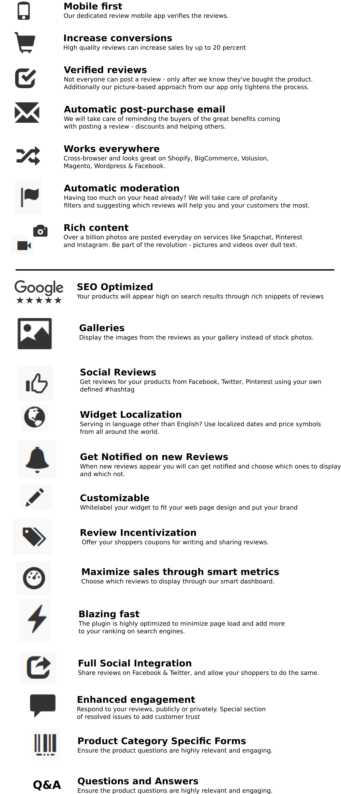

# Strategy
The big idea is to make everybody happier. We can do this by (controversially) limiting choices. In an age with too much choice we are anxious to select "the right thing" that will make us happy and we spend too much energy thinking if we made the right choice. Find all the best things for you - be it a product, a person or a service - the ultimate personal recommender. Movies, books, restaurants, dating.

See this video for [emotional technology of the future](https://www.youtube.com/watch?v=5u45-x0-zoY) (see the Spouce Finder idea, Socrates and Career finder)

Base this on human simulation by gathering data about the person and simulating the rewards he would gain. The status quo (reddit etc) is democratic voting - but this sucks. In a group of a sheep and wolfs voting what to eat, guess who wins. This way a person can make better decisions and leave the decision fatigue on side.

But we need to start from somewhere. 

## The Millennium Law
The Millennium Law's idea is that you can't become a millionaire before you become a hundred-thousandaire, and you can's become that before you become a ten-thousandaire etc. 

It was originally devised about money but it is also true for other resources - users, team size etc. We don't have the technology for recommendations, nor the users, money or the data. 

Three step plan:
1. Start with product reviews - gather data of reviews about products and services that people can pay us for. Initial capital and users. Also stage where we should get a great team. Give 20% time to next stages.
2. Once we have users, allow for any products to be posted - ala producthunt. Get percentage of sales from websites that get visitors from us (referrals or ads). Gather more users and data. Start beta testing with other recommenders - about music or movies.
3. Connect all the products and people opinions to get recommendations about anything. Ask people to donate anonymized data for scientific research, machine learning etc.

## Situational awareness as of 21 June 2016
The situation is messy code and inconsistent requirements. We have some clients using the product but not paying because the system is broken. We also have people uninstalled the product for similar reasons.

On the other hand we know the market and the done the research for two years now. We know it's a billions dollars market available for grabs, we know a lot about reviews, we've done a lot and we know there can be lots more to be done. We know a lot can be learnt in web dev, DevOps, machine learning, networking, mobile app, physical web.

# Short term plan
The critical problem is that we don't get money. This must be a priority. Always. Optimize at the bottleneck, otherwise it is meaningless. The bottleneck right now is technological. 

Basically answer - are the shops getting enough perceived value to pay Opinew and are they aware of it? 

Only then we can start gathering data for baseline tests, optimise the technology for quick, scalable deployment and testing, add more features, expand to more platforms or ask more shops to install via marketing campaigns, main website, SEO, lead generation, sales pipeline etc. Optimising before the bottleneck (market and sales) is meaningless - people will crowd to install only to find it is useless. After - they can't even install so it will be a waste of time since we don't know if the features will be needed.

## Review itself
* Follow the idea of Facebook Messenger/Apple iMessage new announcement and Google’s Alo/Duo messaging app.
* Old school Text review
* Stars
* Emojis
* Add Photos
* Add a Video
* Add GIFs
* Stickers
* Animated Handwriting (like Apple’s messaging - personal, probably mobile only or touchscreen enabled devices)
* Answer specific questions about the product.
* Rate specific aspects of the product
* Review actions
* Allow comments on a review
* Share a review on social
* Flag a review as inappropriate
* Feature a review by the shop owner to highlight it
* Plugin types
* Product plugin
* Shop plugin
* Star aggregate for product snippet
* Star aggregate for shop snippet
* Shop gallery
* Product gallery
* FAQ plugin
* Featured/testimonial plugin (1-5 testimonials)
* Chat head with shop assistant plugin 

## Questions and Answers
* Allow for FAQ about the products that a shop can add.
* Asking a question creates a chat message with the logged in shop assistant, sends a notification to assistants Android apps, opens up a websocket for communication.
* The shop owner can choose public/private Q&A
* Question can have an aka - people ask the same question in different ways.

Gamify: Show checkboxes on top. Highlight the active one. Or a progress bar
Default questions for ALL categories (customer support, how quickly it arrived etc, what is the best thing about the product etc.)
Default questions for specific questions in product category ( how is the battery etc...)
Default questions for user (what is the size of your tshirt - this can help shops and ranking of the review by similarity to a user)
Questions provided from the shop
Questions provided by the users
Review -> ReviewComponent. A Review component holds the question, body, star rating.

## Search
The search can index both reviews, questions and answers for the shop and the product
an omnibox that asks, searches and possibly posts a review (through recognition of question or not)

## Shop communication
Some people like searching manually, some people like real life communication.
Allow for a chat face with a shop assistant to help with questions, orders, info. 
Shop owners testing new products
Ship “beta” products to reviewers for free and get bootstrapping reviews and feedback in return
Collect information on customer experience to drive future product selection 
Service to discover these active users in the community

## Incentives for more reviews
Physical reminder - Print it on the QR code leaflet.
<Send a "did you like it" email>
Big Yes/No that redirects to a form with the order
<Help other people/altruism>
Help more than 3000 other people choose the right skirt.
<Help the store [shop description]>
"Rachel McMillan" is an independent label that helps young people find the right look. It needs your reviews to help it grow.
<Financial incentive>
Get 20% off the price that you payed by providing this review.
<Recognition from crowd>
Reviewer badges - new reviewer, experienced etc.
You are just 2 reviews away from getting the Gold reviewer badge in Clothes.
<Social proof>
Here are some reviews people already left for that product/this store.
<What should I write?>
Provide hints what is important for this product - durability, battery etc.
<Once and done>
The Opinew Promise (hitting people that don't want to be bothered)
Hey, we know some people can't be bothered reviewing things (even for discounts) and we also don't want to beg people for reviews. Click this button if you never want to be notified again.

## Main Website of Opinew == Product Hunt
Submit ala reddit/HN:
Submit a URL that you have found on the web OR
Product name + description + price + image + delivery method ( + map ? craigslist)
Users can post products they found around the web - URL
Users can upvote products, comment on them
A shop owner can include an Opinew plugin, then the comments become reviews
This is free. If the owner has a shop at shopify, provide with payment plan so that automatic reviews can be there
Let users find cool products with good reviews - through search, upvote listings of categories, locations; sort by popularity, new, seller’s rating
Let shop owners get more traffic to their products
Allow anyone to sell things
User profile details - gender, location, age, interests
Personalization with an onboarding process
Collect data points on customer preferences / style / activities. 46% of active clients provide Pinterest profiles. Stylists use Pinterest boards + access to algorithms to help improve product selection

## Quality Reviews
Verified reviews through unique URL emails and physical QR codes on delivery
Mark reviews as unverified: People don't expect to see verified but an unverified incentivises good ones
Verified users through login system
When you post a review for the first time you need to verify your email. This is to prevent people and shop owners from easily faking the reviews by posting reviews with emails like aa@a.a and still have the review appear.
Profanity filter
Rank reviews by usefulness
Has picture/video etc?
Quality of text, length of text etc
Low involvement users - usually aimlessly browsing through products. Prefer summaries, quantity of reviews, not affected as much by quality
High involvement users - usually searching for a particular product. Prefer high quality reviews (both with positive and negative stuff, but concentrate on the negative). However, due to anchoring effect, don't show a negative review first. Best is second. Also, look for users that are similar to the current one.
Perform runtime recognition of low/high involvement user - browsing vs searching.
Featured based products / Utilitarian - products which can be decomposed into a bundle of characteristics. E.g. Dishwasher, beauty products, phones, laptops. Reviews that confirm the information in the product description. Better for high involvement users.
Experience goods / Hedonistic - movies, games, books - Reviews with more subjective information. Users prefer first objective description (e.g. the plot) and then personalized, opinionated view.
Perform precompiled characterisation into featured vs hedonic
Readability metrics (ARI, Gunning index, Coleman-Liau index, Flesch Reading Ease, Flesch-Kincaid Grade Level, SMOG), spelling error as first proxies for helpfulness.
In general, subjective + objective drive sales more than purely subjective or purely objective review
https://pypi.python.org/pypi/textblob
Remove fakes
Behavioural aspects - IP, machine, user logged in etc
Too many reviews from the same IP is suspicious
Textual aspects - length, quality of text etc
Gibberish
Swear words, defamatory speak
Fake review linguistic score
Fake review behavioral score (display yes/no, keep score and threshold on backend)
Flagged by users count
Legibility score
Sentiment analysis
Helpful linguistic score
Helpful votes
Shares on social network
Picture contains product?
Date published
Comes from a post purchase email? (Show red unverified review otherwise)
Comes from a shop generated review request (shop verified)
Is the review by a shop owner or staff?
User with registration?
User reviews count
User likes count
User has fb account?
User's fb account seems real
Customer journey interactions
Endorsed review - ina blog/vlog or ad
In a pop up Explain how this particular review was created: from a review request/on site/by verified user, was it edited, has it resolved a problem (cust journey) etc

## More reviews
Shop owner add a review from source - twitter/fb/blog/YouTube etc... And a dashboard tab "external reviews " where one can auth social networks (start with twitter-tweet_id, then instagram), accept reviews and decide for which product it should appear…
Facebook reviews https://developers.facebook.com/docs/graph-api/reference/page/ratings/
Twitter API - mentions. Suggest for which product is the review. https://dev.twitter.com/rest/reference/get/statuses/mentions_timeline
Instagram mention API https://instagram.com/developer/endpoints/tags/#get_tags_media_recent
Review type - blog post
Tripadvisor http://www.tripadvisor.co.uk/Attraction_Review-g186534-d2043678-Reviews-Beauty_Kitchen-Glasgow_Scotland.html
Snapchat
Pinterest
Store can generate a Review Request.
Store can verify reviews ("verified by store" badge)
Custom features drag&drop - start with a simple text field. Add photo, GIF, emojis. Add custom star fields on product types. Add custom text fields.
review.is_problem and review.resolved -> add if review less than 4 stars; Allow the shop to choose whether to publicize the review on their plugin. Mark as resolved by the reviewer. On 4 stars auto reply to reviewer after x seconds "we are sorry that you experienced an issue, let me contact our team and see what we can do to resolve it!"

## Shop Dashboard
First thing to see is the analytics
Under analytics display the number of reviews and under that the actual reviews that were left by people. Could do with some sorting by number of stars or date but that’s not necessary.
When shop In the trial period, display a div at the top saying “Your free trial ends in X days. Please enter your card details here(link) to continue using Opinew after the trial period”. That should be visible no matter which tab we are in.
Remove the Scheduled tab
In the Orders tab, remove the Shipped/Notify button. It’s going to be automatic anyway. Also rename it to “scheduled email reminders”
Create a tab for the review request email editing. This is partly done already. Use the view which appears after you click “Notify Now” - the one where you view the email that’s going to be sent. Enable the shop owner to edit the text of the Subject(Already there) and body of the review request email. Only text, no fancy styling.

Incoming - Important: low rated reviews requiring input, flagged reviews, unanswered questions, billing, change of password; Coming reviews from social networks; suggestions - get at least 10 reviews for this product;
Scheduled - review requests (add a review request);  unshipped orders
Reviews - filter by stars, product; show how many times it was seen based on load, mouse over events; import from Facebook, Instagram, twitter, youtube
Questions - Filter per product, for shop, visible publicly etc
Campaigns - create a #hashtag for your social networks; keep an eye on the #, put into incoming, ask for permission, assign to a product/shop
Analytics - review request sent/opened/clicked/converted; how many times the plugin seen, interacted with etc. How many of the reviews are verified, how many orders came from reviews;
Account and billing
Settings - shop name, mission, "by shop owner" badge; plugins - product plugin, star plugin, shop plugin, product gallery plugin, customer support plugin (person face); list of staff members, email for RR, Shop FAQ, product general FAQ, product specific FAQ, send email on: new review/only under 3 stars, new question

## Analytics
How many people viewed the review sections
How many people who viewed the review sections also did the purchase
Note: Need to define what “viewed” means. Just loaded is kinda false - we probably need to know if somebody at least glimpsed the review section

Funnel stream for each review - correlate reviews to orders
Funnel stream match user agent as well
Getting and tracking product prices we can prove in monetary value how much we have brought
85% need 10 reviews - make a campaign to get 10 reviews by coupons. Find the products with relatively high sales but low review count
"Thank u for leaving a review. To show your review to more people, we invite you to help them by adding some extra info to your profile - how about a photo or what you are interested in." This brings more credibility. Rank metric - is it real profile PIC?

### ReviewInteraction
User ID - could be anonymous, i.e. None
Review Id
FunnelStream Id
Load TS
MouseOver TS
MoreClick TS
LikeClick TS
FlagClick TS
ShareClick TS
UserClick TS
Customer Journey
Initial idea
When a negative review(1* or 2*) appears, don’t show it. Instead put it onto a special logical path where there are 7 days to resolve the issue.

Conditions:
If the shop doesn’t decide to act, the review is posted.(edge case 1)
If the buyer doesn’t respond to the shop, review is not posted.(edge case 2)
Once the shop writes the first response (first action when the customer journey starts), start displaying a “problem resolved” button to the user. “Problem not resolved” button is displayed as a small, greyed out button.
Once “problem resolved” button is clicked, the effect is final and cannot be reversed
On the 7th day the “problem not resolved” button is activated
If there was interaction between buyer and shopper(at least 1 shop msg and at least 1 buyer response) AND the buyer did not click on any of the buttons after 7 days THEN after 3 days from the 7 day mark, mark problem as resolved (final, cannot be reversed)

### Improvements
Inspired by this: http://www.coryklein.com/2016/06/20/scammers-replacing-iphones-with-clay.html HN thread https://news.ycombinator.com/item?id=11939420
1. On Order creation, Opinew creates a unique QR code for the shop owner to print and put inside of the packaging. The QR code has also a typeable URL and a specific Question about the product quality.
2. The shop owner creates a video of the product being put in the box together with the QR code. The video is uploaded to Opinew servers and secured. (this is inspired through HN com ments on the article)
3. Delivery is tracked with a tracking number
4. The owner shoots an unboxing video. Also, the QR code acts as an automatic unique review URL which can be accessed on the web or through a dedicated Opinew app

This also helps solving the following use cases:
1. Increase the likelihood of a review. 
Sending a QR code with direct URL for review will prompt more users to leave a verified review. The same URL will be send as an email (if the URL hasn’t been used before).

2. Increase the quality of a review.
Prompting to add pictures, video or answer a specific question about the product will increase the review quality thus boosting sales.

3. Complaint: Product was not delivered.
- Has the tracking number said that delivery was done?
    = If yes, customer is lying.
    = If no, customer is right. Notify the customer that delivery is expected in next X days.
- If there is no tracking number, assume customer is right. Notify shop owner for money back. (The shop owner should have put a tracking number, it's his fault)

4. Complaint: Product was visually different on delivery
- If the shop owner hasn't shot a video, customer is right.
- The product could be damaged on delivery. Customer is right, return money.
- If the shop owner has shot a video, compare the videos and make a judgement who lies (if anyone lies that is - the product could be damaged through delivery).
  = The owner could have shot a video of a legitimate product and then sent a fake.  - Can we see a continuous video of product packaging, delivery number printed on the box and given to delivery guy?
  = The receiver could have shot a video of a fake product but received a legitimate - Can we see a continuous video of authentic delivery guy, unboxing etc?
    = In both cases, if we assume we trust the delivery time, minimizing the time between video shot and delivery would increase the confidence, i.e.:
    |___________|_______|___________________________________|________|_______________|
       Video shop         ? time                            DELIVERY                           ? time      Video reviewer

### Sending email reminders
Email -- Important Business related feature
That’s what we need, read:
https://medium.com/@andreirebrov/email-marketing-from-tech-perspective-d0b5707b3533#.86cmeqatu

### When send emails:
Reminders for entering the card details
10 days before
5 days before
3 days before
1 day before -- reminder that service will be cut off when they don’t pay
Generally create it in the way that any other email events can be easily integrated in the service. If we want to send an email when event x happens. Create rules for emails
Be able to unsubscribe
Be able to create rules for email marketing(remember the decision tree?)
keep track if any of the shops from the email marketing campaign list have installed opinew. Stop sending marketing emails if they join (lookup by domain name for ex. “shop.myshopify.com”)
Escape the iframe
Prefix classes with opinew-
Escape the iframe
Load more on scroll of reviews and log it.
Log clicking on more of a review.
Log mouse over events
Log clicking on Like button even when not subscribed as a metric of whether we should consider unauthorised users to like

## SEO and optimizations
Separate the media and static server (media.opinew.com and static.opinew.com)
Flask-CDN to get assets from CDN: https://flask-cdn.readthedocs.org/en/v1.0.0/
Eliminate render-blocking JavaScript and CSS in above-the-fold content
Keyword consistency among title, desc, h-levels : reviews (18) trial (4) etc…
Remove inline styles
Leverage browser caching
Optimize images
Enable compression
Minify CSS, JS
Optimize your pages titles
Page titles are important for search engine relevance and they will also be the first thing users see in search results, so it’s important they are logical for the search query and users feel confident clicking on them.

They should be optimized as an accurate reflection for what is on that particular page to avoid being flagged by Google, or users simply feeling tricked when they arrive on your website.

A unique title should be created for each page. Avoid duplication, particularly due to automation on larger websites. Try to avoid boilerplate titles as far as possible.

Titles should be 70 characters or less (including spaces) and should include your keywords as early as possible. The brand should only be placed first on the homepage of your website.

Avoid spammy keywords such as Free, Cheap etc.

Use combinations of terms such as city names and industry terms to add relevance.

Keep the keywords consistent with those in your content, sub-headings (H tags) and meta descriptions.

http://blog.woorank.com/2013/03/10-tips-for-title-tag-optimization
https://support.google.com/webmasters/answer/35624?hl=en

DEVELOP A KEYWORD RESEARCH
Why it's importantThe most important element of a successful search engine optimisation strategy is picking the right keywords to target. Not only will it inform your wider marketing activity, but also trying to rank for the wrong keywords will cost time and money.

Accurate research will let you identify the correct opportunities to aim for, and give you plenty of insight into how to achieve them.

Choose the most accurate keywords related to your product, brand or service with a reasonable search volume with a lack of competitors. Look for longer phrases (long-tail) opportunities.

Common terms and phrases are more achievable than attempting to force users into adopting new words just to find your website.

Start by brainstorming as many potential words and phrases searchers may use, and look at what is actually resulting in visits to your website via your analytics platform.

Add additional suggestions via free online tools, including looking at the common results supplied via Google Autocomplete.

Watch for growing trends and opportunities via Google Trends.
http://blog.woorank.com/2012/10/16-free-keyword-research-tools-seo/
http://blog.woorank.com/2013/09/keyword-strategy-identify-measure-repeat/

OPTIMIZE YOUR SITE CONTENT
Attempting to rank for all desired keywords with one page of your website is not only impossible, but won’t be always relevant and easy to use for your site visitors.

Instead, you should develop each unique page and piece of content to target one particular keyword, topic or phrase and use is consistently across all the visible and metadata associated with that URL. Combining that with unique, quality content will give you the highest scores for relevance, and the best chance of achieving prominent search engine rankings.

Ensure your keyword or keyphrase appears in your page titles and headlines, ideally towards the front of each.

Use your keyword throughout your content. Frequency is useful, but avoid forcing your keyword into every sentence, and use related words, phrases and topics to add authority and readability to your content. Maintain a high ratio of text to HTML.

Break up text with sub-headings, ensure they are tagged with tags and use your keyword or phrase.

Your keyword or phrase should also appear in image ALT text and captions where possible, and in the meta description for the page, which is what will appear in search results under your page title.

Check your content isn’t duplicated elsewhere on your site, or is being copied by other websites.

http://blog.woorank.com/2013/06/duplicate-content-7-ways-to-get-rid-of-it/
http://www.google.com/support/webmasters/bin/answer.py?hl=en&answer=66358
http://www.copyscape.com/

BLOG
Your website does not have a blog.
In this tough and competitive internet marketing world, content marketing rules. While publishing your content on other sites might be a good strategy, publishing it on your own site garners more benefits.
Starting a blog is a great way to engage with your audience and increase your online visibility by attracting qualified traffic from new sources.
Use our tips to optimize your blog and improve performance.
If you don't feel that a blog is right for your business, consider other ways to build useful evergreen content, such as online guides and whitepapers.

Why it's importantBlogs are a great way to publish fresh content on a regular basis to your site, attracting visitors and helping it to rank for your desired keywords.

Given the huge rise in business blogging, it’s important to make sure you are publishing content that your audience will find useful, attractive and therefore recommend and share. Balance self-promotion with valuable resources for your industry and customers, insights into your business, and content which helps to build the community in your industry.

Ensure your blog is set up on your domain, e.g. http://blog.example.com, or http://www.example.com/blog/ rather than using an external platform, such as Blogger, Tumblr, etc. Optimize the design, and avoid slowing page loads by adding sidebar widgets that won’t be useful for your readers.

Plan an Editorial Calendar to set out the keywords and subjects you will target, and supplement this with monitoring news and trending keywords relevant to your business.

Register your blog with directories such as Technorati, Google+ Publisher and the Authorship markup.

Optimize each post for SEO, and promote each one on Social Media. While SEO titles should be factual for the keywords to target, social media promotion should be rewritten to be more enticing.

Monitor and respond to comments promptly. Services such as Akismet and Disqus can help to tackle and reduce spam comments.

http://blog.woorank.com/2014/10/promote-blog-social-media/
http://socialmediatoday.com/node/508468
http://blog.woorank.com/2013/02/blogging-for-seo-seo-for-your-blog/
http://www.socialmediaexaminer.com/7-tips-to-increase-your-blog-comments/

## Rich Snippets
* Google rich snippets: 
https://developers.Google.com/structured-data
https://developers.google.com/structured-data/rich-snippets/products
https://developers.google.com/structured-data/rich-snippets/reviews
* Microsites for SEO

## Android apps
For the business owner - get notifications on reviews, questions, chat etc depending on role - shop owner or shop assistant.
For the reviewer - easily make a review, product hunt, get discounts and vouchers 

## API 
So that bigger shops can implement it and use the infra

## Physical Web
Read reviews in store - about the shop, about the product
Provide a service to help retailers place BLE beacons to attract customers.
Allow for nearby notifications, physical web etc https://developers.google.com/beacons/get-started 

## Yotpo Feature requests
88 - Plugin for Virtuemart (Joomla)
We are currently researching the possibility of creating a plugin for Virtuemart. Currently there is no ETA on when we will launch such a plugin.
72 - Support for Rich Snippets in Big Commerce
It'd be great to have all these stars in our reviews be displayed in Google search results.
65 - Yotpo is slowing page load - Require CSS optimization
According to Google, Yotpo really slows your website page load. 
This is really problematic as loading speed is now an important ranking factor for search engines.

Yotpo need to optimise their CSS:

@Minify CSS for the following resources to reduce their size by 11.9KiB (56% reduction). 
Minifying http://staticw2.yotpo.com/…mC0JRt4lsnZr/widget.css?widget_version=1 could save 11.9KiB (56% reduction) after compression.@
48 - Enable Picture Reviews
At the moment, I receive pictures of my customers wearing my products and I would like to be able to show these pictures to potential buyers. 
A picture taken by a user creates trust and increases sales. 
Can you add a feature that allows a reviewer to upload pictures?
44 - Multiple product reviews in 1 email
Instead of sending out an email for each product ordered, it would be much more simple and less confusing for the customers 
if they could review each product (or the 3 most expensive items from their ordrer) in the same email. 
42 - Send review requests manually.
Customers sometimes delete their review request emails, or maybe they just can't find it. It'd be great to be able to click on 
an order/email and have the review sent again.
If I convince a customer to fill out a review by talking with them on the phone, I currently have no way of giving it to them.
33 - vk.com (Vkontakte) integration
Largest and most popular social site on exUSSR region. Clone of FaceBook — over 80 000 000 peoples. 
Please make integration with it — login, share etc. http://vk.com/dev

32 - Rich spinets for EVERY platforms come on! - also if is not asking for much, 
adding specific questions for the reviewer to rate.
We should be getting the benefits of rich spinets for every platforms not just the "few". 
Also it would be awesome to be able to add your own questions for the clients to rate your products base on WHAT you sale.
28 - The previous "Verified Buyer" seals looked more professional and made for a 
better conversion rate.
The previous "Verified Buyer" seals made the reviews look more believable and made for a better conversion rate. The idea is to make these reviews look legitimately as possible, and seals always help.
Also, there should be an option to make signing into a social account to leave a review a requirement and not an option. Having the reviewers photo by their review will without a doubt increase conversion rates. 
Without a photo by the review, it can look like the shop owner added the reviews.
While this may lower the amount of reviews that are left, it will increase the quality of the reviews which is far better in the long run.

28 - Be able to enter in a list of coupon codes for yotpo to dole out only once per code.
This way, people could generate a list of codes in their shopping cart engine, and post it to yotpo. Allowing for us to specify that each code can only be used once while not having to manually change it every single time.
23 - Edit e-mail design
I really need a better way that e-mail messages are displayed in Outlook. It is almost the worst, most horrible design I have ever seen... Lots of images do not appear, nothing is lined out correctly, there are a dozen font types being used, nothing looks consistent. 
It would help to set the font to Arial, with just one size (maybe 12px) so even Outlook displays it badly, you can still read it.
17 - Reorder the Review form BELOW the reviews
In the Reviews Tab, the Post Review form appears ABOVE the reviews. I would like to see the option to rearrange the form to show BELOW the reviews.
This way, visitors see the reviews first, and if they decide to write a review, they see the form when they get to the bottom of the list.
Thanks for considering this as an option/feature request. 
16 - Support OpenCart 2
It has been more than 7 months since Opencart V2 released but Yotpo has not done anything to make it compatible with OpenCart 2. I will wait another month and if nothing comes up, will cancel my membership.
16 - Wix integration
15 - MultiStore and Rich Snippets module in Opencart
15 - Multi Language / Multi Lingual
14 - Star Rating in Search Results for BigCommerce
We are well into the platinum category for reviews, and our customers are constantly asking us why we they can't see the star ratings in the search results in BigCommerce. It would be ideal if the star ratings showed anywhere a product was 
displayed, instead of having to add the code manually everywhere. The search results don't have an option where you can add the code, so maybe replacing the built in star ratings code in BigCommerce might be a suitable fix.

14 - Magento Extension - Show Reviews on Page not in JS Widget & Optimisation
13 - Add Option to Send Review Email on Order Completion
Currently the Yotpo system sends review email requests on x days after the customer purchase date, not the completion date. (WooCommerce)
Q. How can Yotpo control the length of time between an 
order being purchased and completed on the customer side and always say the mail will be sent at the same time?
In our situation we make jewellery, in most cases this has a variable 
amount of time for the order to be made, typically 9-21 days.
We set the order to complete when the order has been made, this time-frame varies per customer/order, the completed status ensures the customer gets the postage tracking & invoice etc.
With the existing Yotpo system using the mail after purchase, we cannot control when the customer will receive the review email as the time between the customer placing the order and receiving their jewellery is not always the same, often times this results in customers getting the review email before their final product. Clearly this isn't very effective for us.
Is there any chance you can provide the option for both settings i.e mail after purchase and mail after order completed?
This will provide a lot more flexibility and importantly more reviews.
Thanks in advance.
12 - The ability to have the statistics on Star Rating
8 - Product reviewed by customer already - do not send email
8 - Staff Review
Option to add staff review at the top of the page to help guide customers, would be especially to provide fit information for customers buying shoes and clothing.
8 - Schedule posts to Facebook
Instead of instantly pushing reviews to Facebook we should be able to schedule reviews so that the post arrives into social media at our customers peak interest times. For my business customer are 
most active at 6pm until 9pm so I would like to schedule 6pm and 8pm so it's in a prominent position and recent on their feed list as opposed to being listed at random times. I'm in a timezone 12 hours
 from my customers so doing it manually is a nightmare. This may have huge impact on conversions!
8 - Multiple rating fields
I'm owning a store who products needs multiple ratings like Design, performance , build quality and an overall rating (automatically calculated)
8 - Allow for a customer to post a photo to a review.
Make it easy for someone to post a review and quickly upload photos (via desktop or mobile) related to the review.
7 - Use Gravatar/Facebook/GMail for user review pictures
99% of User images are blank, but there are many sources to pull an image from. Adding a face to a review would help.
7 - When a product doesn't have any reviews, instead show store reviews or reviews of all products
"This product doesn't have any reviews" is not helpful. Instead, when a product doesn't yet have any reviews, show either store reviews or reviews of all other products.
6 - Add custom (optional) fields for customers, such as height, size, body type for apparel ecommerce
I have an apparel ecommerce store, and I'd like to be able to ask customers for their height, size, body type and possibly measurements, so that other customers can read reviews on a product from someone with a similar body. I'd at least like 
to have 1 or 2 of these. Rent the Runway (a well-known apparel ecommerce/rental company) does this and it's SO helpful when trying to choose your size. 
Just having the option of some fields for the store owner to customize could work across any industry I would imagine.
6 - Post images and On-Page SEO
I will be very happy if you add two new features: 
The first one is: Possibilities to post/upload images in comment form 
The second one is: On-Page SEO and rich snippets, but not as now SEO on MiniSite.
6 - Where people who leave a review show where they're from.
I have international customers that I would like to show potential customers that I can ship to their location.
6 - agregate data for multiple Product IDs (in case of product variants)
SquareSpace Ecommerce assigns unique product IDs to each variant of a product. So a single product page can have 2 or more product IDs, one for each variant (like size or color).
It would be nice if the embed widget could show the aggregate data and reviews for multiple product IDs combined.
6 - Share review incentive using coupon codes should be shown on "Thank you for posting a review page"
Currently you have to add text to the "Mail after purchase" email template explaining that if you share a review on social media you will receive a coupon code. This makes the "mail after purchase" email a little messy.
The coupon incentive for sharing a review would be better displayed on the "Thank you for posting a review" page either directly below or above the social share icons as I think this would dramatically increase the likelihood of a 
customer sharing a review, and after-all, that is what we want!
5 - Badges
Customer Badge Engagement Program ( I love Yotpo! but the current program is really not very good)
I can explain it all here but...first you need to look at what TravelAdvisor is doing with badges so we don't reinvent the wheel here. Sign up for an account and start reviewing restaurants, etc.
I would like to see the badge system for customer badges (not total site review badges) work like this...
-A customer submits a review
-They get a customized email thanking them and telling them how many more reviews till their next badge
-If customer has more purchases than reviews an email sends to remind customer they are only 4 reviews away from their XX Badge with incentive "XX Badge holder get exclusive special coupons and offers".
The badge images need to be individually customizable per each Yotpo environment/branding. Kinda funny, cute whatever.
I realize currently YOTPO members are all lumped together globally. This new badge system would need to differentiate reviews for the current site they are visiting vs total global Yotpo Reviews.
A host of reward coupon codes could be loaded into YOTPO to send to customers that are deserving based on rules. AKA what badge level, etc.
It's worth doing and you'll see what I mean after a week or two with Trip Advisor. They base their email frequency on your involvement and stoke a fire where there is one. If you don't participate much it will leave you alone.
This is really...not an idea, it's already pretty much standard practice and common sense customer engagement. Not sure why this got overlooked somehow with Yotpo but it's time to implement it before somebody comes out with Yotpo 2 with
engaging badge system and rips you guys off bad.
I come from a line of innovators and inventors...patents/designs/ideas aren't worth much...unless you do it the best way first.
Please contact me if I've missed some details, etc. All of this really is just waiting for you on Trip Advisor. Love your software, hope this gets to the right person there.
4 - Mail after purchase - option to set a filter by product or category
Option NOT to send mail after purchase to certain products or categories - for instance subscriptions or items on sale. 
This to avoid in some cases to give further discount to products that are already discounted. We offer a 10% discount code to customers that do a review. We do not want them to be able to use this code on items on sale or 
subscriptions that are already at a lower price.
4- product photos sent by the customer after purchase
I think the customer should be able to send pictures of the product after receiving it. Upon delivery it takes a picture and attached to the email confirmation after delivery and receive a discount coupon for your next purchase

## 10x Reviews Ideas
* User profiles
* View reviews on platform's website
* Embeddable widget
* Post star review
* Post text review
* Post photo review
* Post video review
* Post Link from Youtube -> Embedded video
* Verified review by post-purchase email
* Reviews by store owner / staff / merchant
* Reviews with memes / GIFs
* Reviews with Emojis / Stickers
* Product categories
* Automatic post-purchase email
* Comment on reviews
* The customer journey
* How many people has this review helped
* Helpful badges
* Review approval by shop owner
* Spam filtering
* Galeries plugin
* Google Rich Snippets / SEO optimization
* Reviews from Facebook page
* Reviews from Twtiter stream by # or @
* Reviews from Instagram by tag
* Send monthly analytics report to shop. (No of reviews, which are products with best reviews etc.)
* Share the reviews on social networks
* Free version available?
* Send review requests manually
* Multiple product reviews in one email
* Multiple rating fields depending on product category
* Reviews from within email
* Coupon codes
* Mobile app for shops
* Mobile app for reviewers
* Widget localization
* Widget customization
* Email template customization
* Reviews sentiment analysis
* Questions and Answers
* Mark review helpful/unhelpful
* Has shopify app?
* Has magento app?
* Has squarespace app?
* Has woocommerce app / wordpress plugin?
* Reviewer info - e.g. height, weight etc for clothes
* Post reviews about any product - product database
* Import product reviews from old website
* Reviews before a product is lunched - exclusive beta testers
* Customer service rating (separate) - Timeliness of Delivery, Quality of Packaging, Overall Service, Would you buy again, Would you refer others
* Collection of all your reviews - means of completeness of areas of expertise

